# Runtime Flows

Current implementation. The home route is a development identity surface;
`/authorize` includes capability review, local identity selection, Google-backed
create or restore, approval, cancellation, callbacks, and local terminal states.

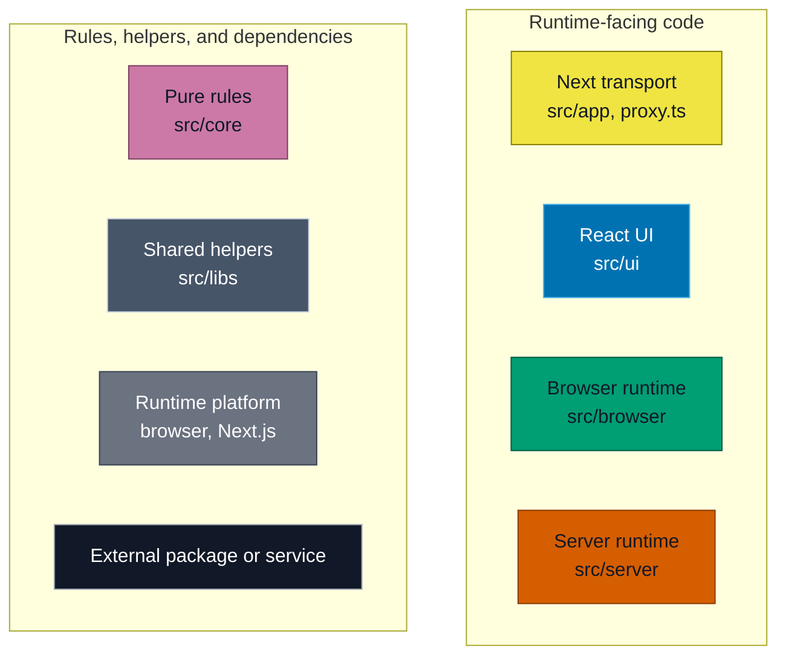

## Import Boundaries

Arrows in this diagram only mean direct imports in current production code.

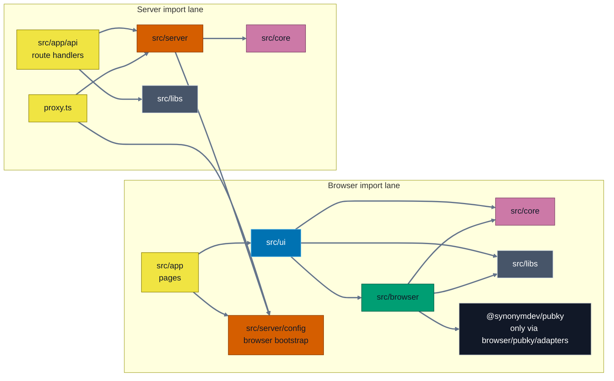

Enforced by ESLint, `test-utils/architecture/architecture-boundaries.test.ts`, and
the `client-only` / `server-only` markers. Browser application modules do not depend
on controllers or outward layers. Adapters implement application contracts without
depending on controllers. Concrete controllers may use public and application
contracts, while composition modules own adapter and controller wiring.

## Routes

| Route | Entry | Responsibility |
| --- | --- | --- |
| `/` | `src/app/page.tsx::Home` | Development identity panel and manual auth entry. |
| `/authorize` | `src/app/authorize/page.tsx::AuthorizePage` | Review, approve, cancel, callbacks. |
| `GET /api/health` | `src/app/api/health/route.ts::GET` | Health response. |
| `POST /api/wrapping-key/google` | `src/app/api/wrapping-key/google/route.ts::POST` | Verify Google identity and derive wrapping material. |

## Call Flows

In the remaining diagrams:

- Solid arrow: call or network request.
- Dashed arrow: return or result.

### `/authorize` Document Entry

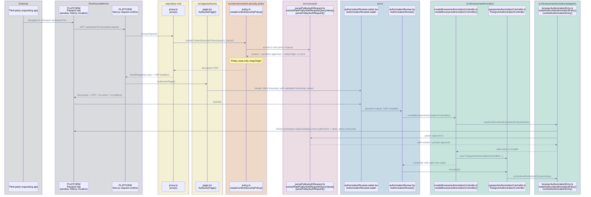

### Manual Authorization

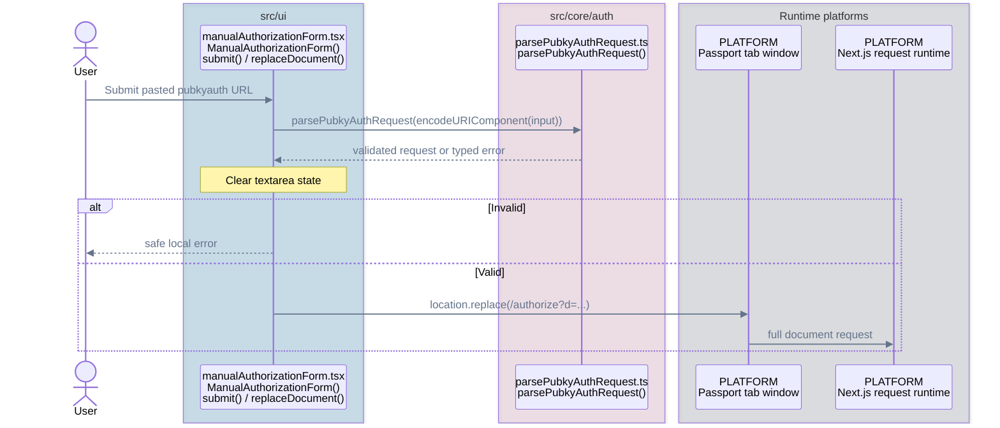

### Approval

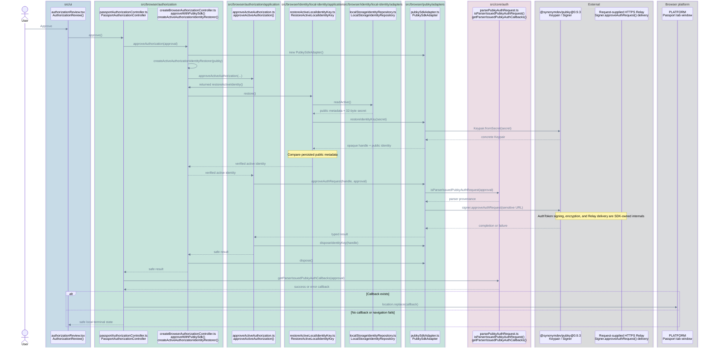

### Cancellation

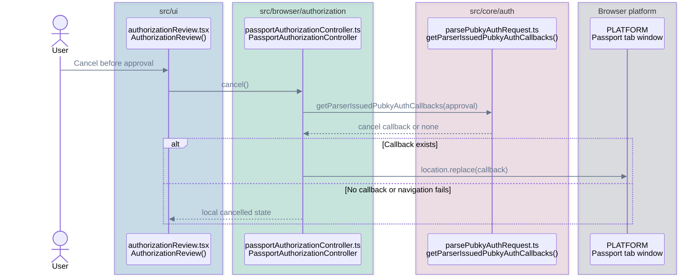

### Google Sign-In And Drive Consent

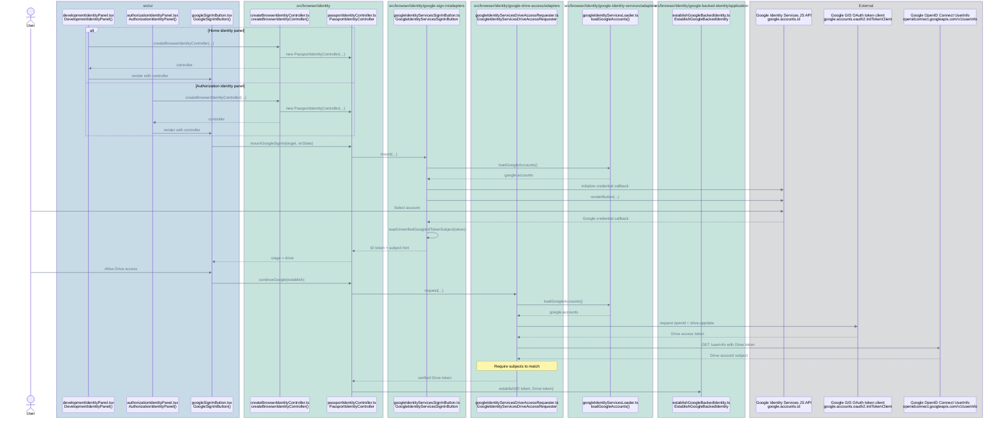

### Establish Google-Backed Identity

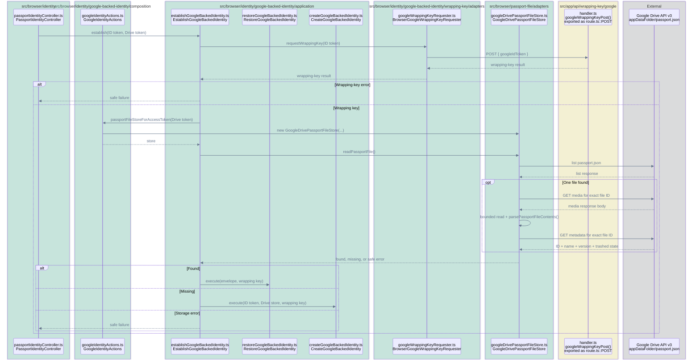

### Restore Existing Identity

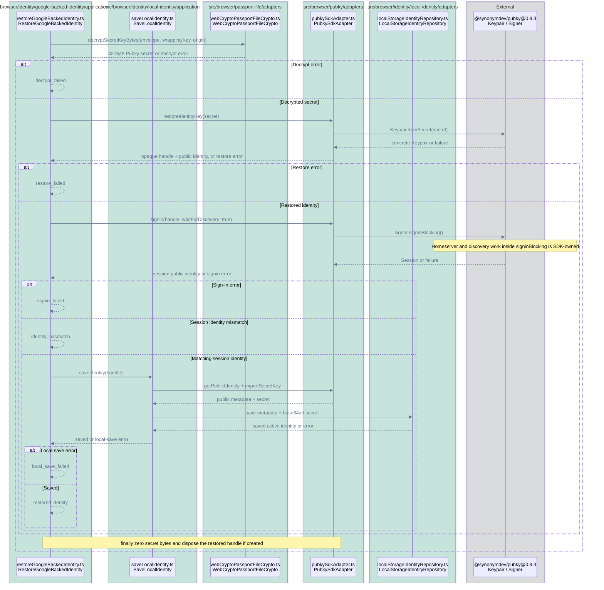

### Create Missing Identity: Encrypt And Store

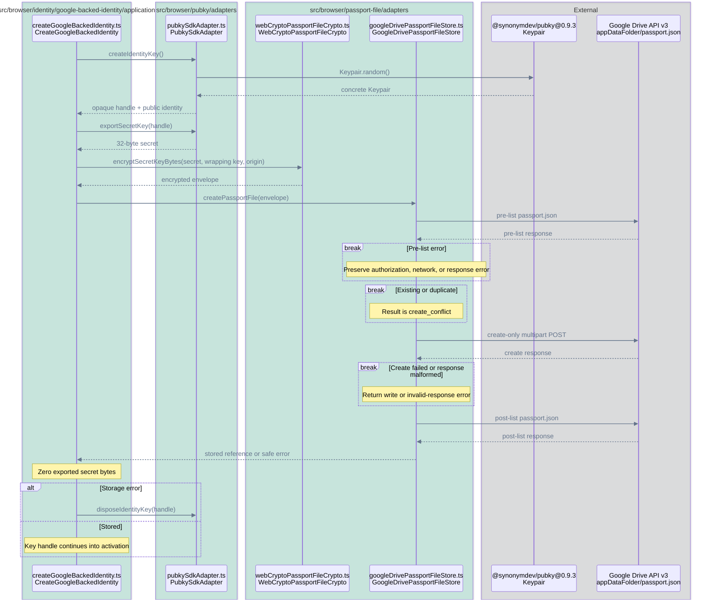

### Create Missing Identity: Activate And Save

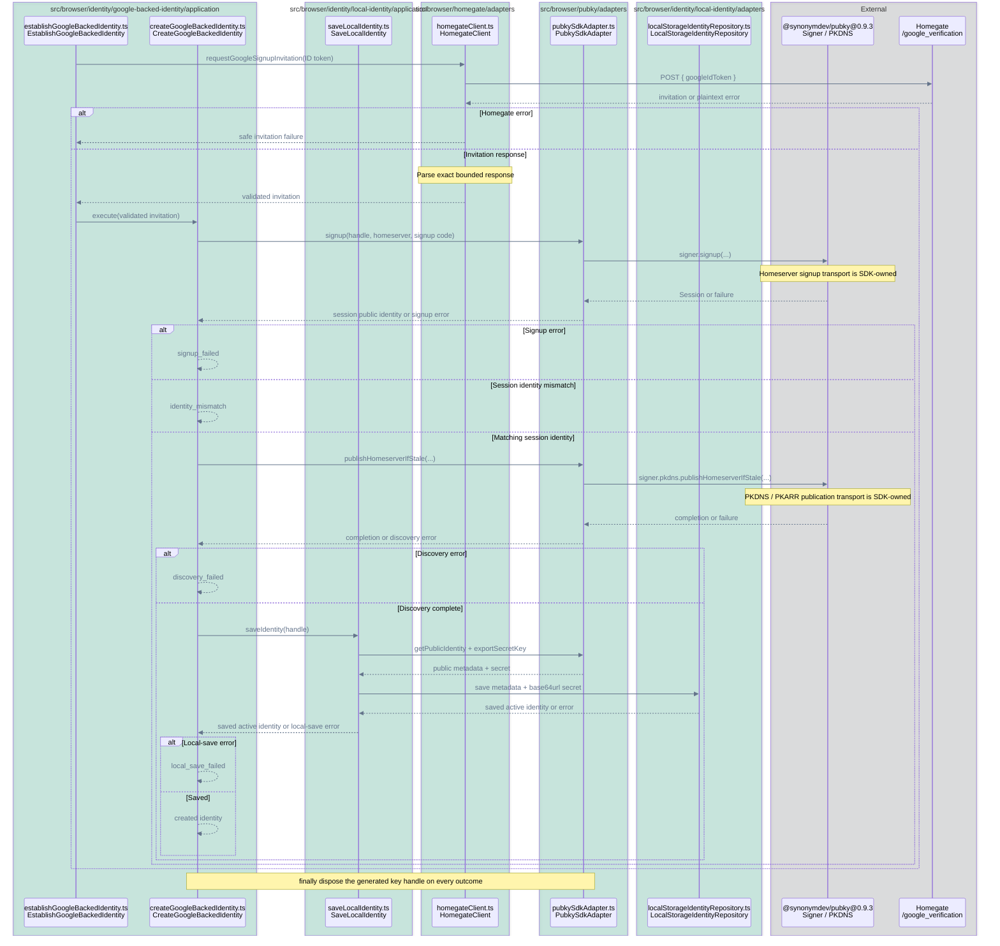

Local ready state is saved last. Failure after Drive creation leaves the encrypted
Drive file but no local ready identity. When a recoverable public identity is
available, the development panel can offer the verified deletion flow below.

### Development-Only Drive Reset

Credential acquisition follows the Google flow above with a delete action. This
diagram starts after the Google ID token and subject-matched Drive access token
return to the controller; the wrapping-key API verifies the ID token below.

This diagram documents the current development-only Drive reset implementation.

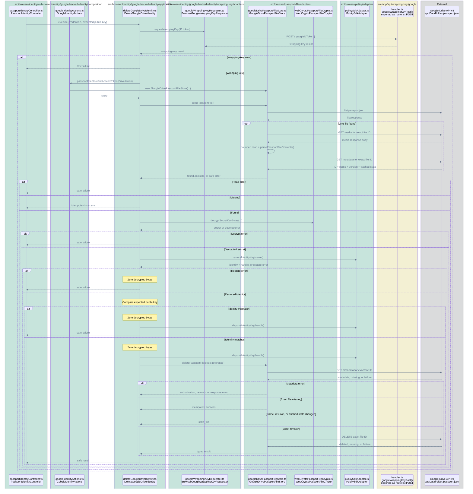

## Server APIs

### Wrapping Key

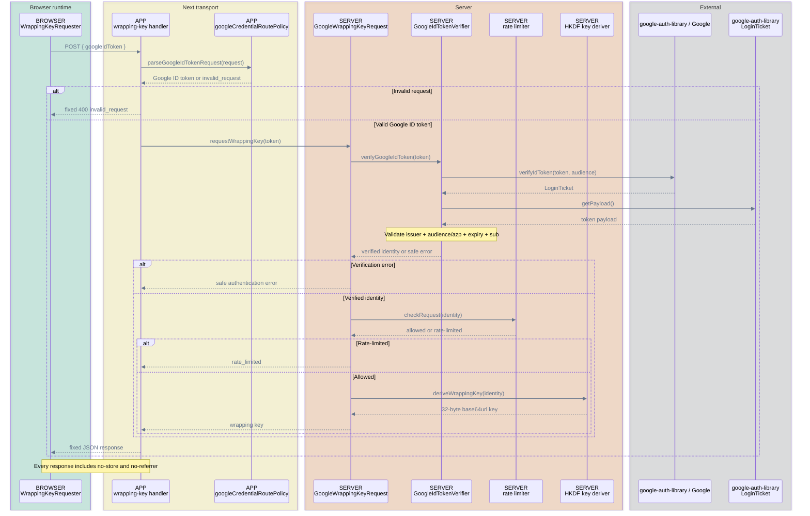

### Homegate Invitation

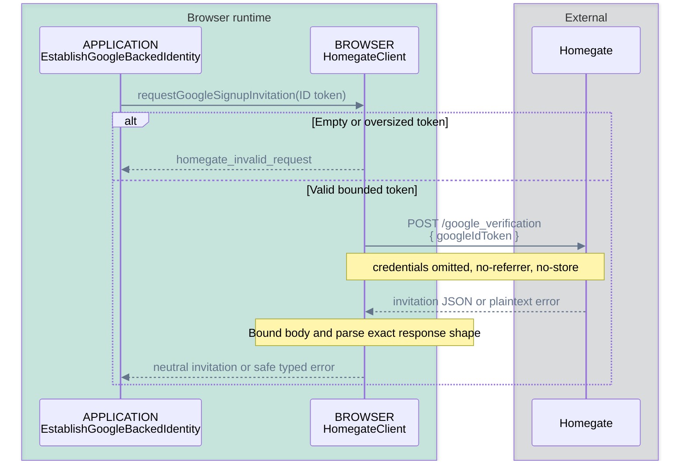

## Reviewer Index

| Flow | Code | Main tests |
| --- | --- | --- |
| Authorization parser | `src/core/auth` | `src/core/auth/*.test.ts` |
| Authorization controller | `src/browser/authorization` | Root controller/factory tests and colocated application tests |
| Authorization browser entry | `src/browser/authorization/adapters/browserAuthorizationEntry.ts` | `adapters/browserAuthorizationEntry.test.ts` |
| Authorization UI | `src/ui/authorizationReview.tsx` | `src/ui/authorizationReview.test.tsx` |
| Google controller and adapters | `src/browser/identity` | `passportIdentityController.test.ts`, capability adapter tests |
| Google-backed identity lifecycle | `src/browser/identity/google-backed-identity` | Colocated application, adapter, and composition tests |
| Drive store and WebCrypto | `src/browser/passport-file/application`, `src/browser/passport-file/adapters` | Colocated adapter tests |
| Pubky SDK adapter | `src/browser/pubky/adapters/pubkySdkAdapter.ts` | `adapters/pubkySdkAdapter.test.ts` |
| Wrapping-key API | `src/app/api/wrapping-key/google`, `src/server/wrapping-key/google` | Route and server tests |
| Browser bootstrap config | `src/server/config/browserBootstrapConfig.ts` | `browserBootstrapConfig.test.ts`, proxy tests |
| Homegate invitation | `src/browser/homegate` | Colocated browser application and adapter tests |
| CSP and boundaries | `proxy.ts`, `next.config.mjs`, architecture test | Proxy, header, policy, architecture tests |
