# Runtime Flows

Current implementation. The home route is a development identity surface;
`/authorize` includes capability review, local Pubky identity selection, the
Google-backed custody/recovery strategy, approval, cancellation, callbacks, and
local terminal states.

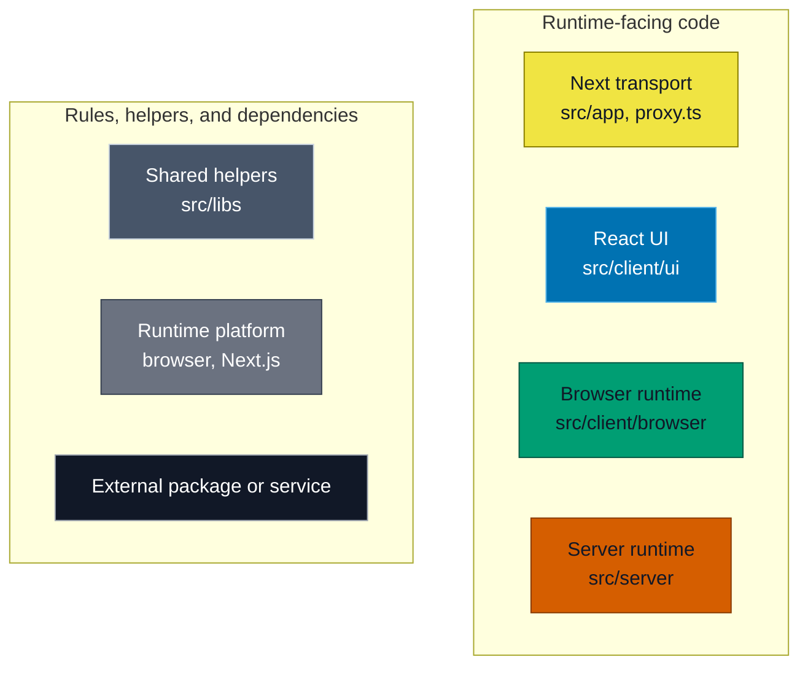

## Import Boundaries

Arrows in this diagram only mean direct imports in current production code.

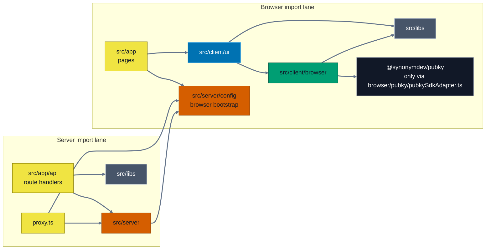

ESLint, `test-utils/architecture/architecture-boundaries.test.ts`, and the
`client-only` / `server-only` markers enforce targeted runtime and security
boundaries. These include browser/server isolation, stable UI browser entries,
approved environment access, SDK and persistence confinement, and sensitive parser
contract confinement. Feature-internal folder roles are not enforced.

## Routes

| Route | Entry | Responsibility |
| --- | --- | --- |
| `/` | `src/app/page.tsx::Home` | Development identity panel and manual auth entry. |
| `/authorize` | `src/app/authorize/page.tsx::AuthorizePage` | Review, approve, cancel, callbacks. |
| `GET /api/health` | `src/app/api/health/route.ts::GET` | Health response. |
| `POST /api/wrapping-key/google` | `src/app/api/wrapping-key/google/route.ts::POST` | Verify provider-account claims and derive a wrapping key. |

## Call Flows

In the remaining diagrams:

- Solid arrow: call or network request.
- Dashed arrow: return or result.

### `/authorize` Document Entry

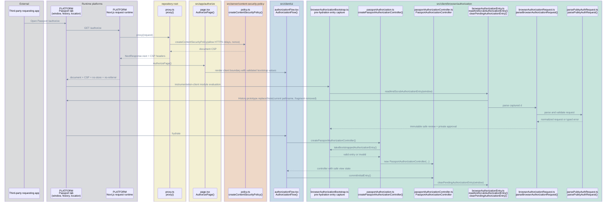


### Manual Authorization

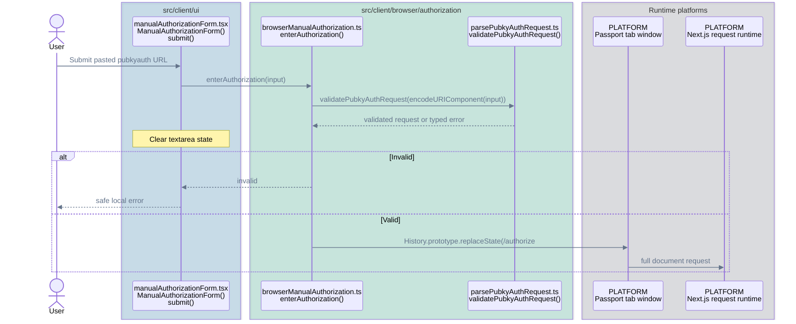

### Approval

```mermaid
%%{init: {"themeVariables": {"signalColor": "#64748B", "signalTextColor": "#64748B"}}}%%
sequenceDiagram
    accTitle: Authorization approval call flow
    accDescr: Passport restores the active local key, asks the Pubky SDK to deliver approval, disposes key resources, and then resolves the validated outcome callback.
    actor User
    box rgba(0, 114, 178, 0.18) src/client/ui
        participant Review as authorizationReview.tsx<br/>AuthorizationReview()
    end
    box rgba(0, 158, 115, 0.18) src/client/browser/authorization
        participant Controller as passportAuthorizationController.ts<br/>PassportAuthorizationController
        participant Composition as passportAuthorization.ts<br/>approveUsingActiveLocalIdentity()
        participant UseCase as approveAuthorizationWithActiveIdentity.ts<br/>approveAuthorizationWithActiveIdentity()
        participant AuthRequest as browserAuthorizationRequest.ts<br/>isPubkyAuthApprovalCapability()<br/>getValidatedAuthorizationCallbacks()
    end
    box rgba(0, 158, 115, 0.18) src/client/browser/identity/local
        participant Local as restoreActiveLocalIdentityKey.ts<br/>RestoreActiveLocalIdentityKey
    end
    box rgba(0, 158, 115, 0.18) src/client/browser/identity/local
        participant Repo as localStorageIdentityRepository.ts<br/>LocalStorageIdentityRepository
    end
    box rgba(0, 158, 115, 0.18) src/client/browser/pubky
        participant Pubky as pubkySdkAdapter.ts<br/>PubkySdkAdapter
    end
    box rgba(17, 24, 39, 0.12) External
        participant SDK as @synonymdev/pubky@0.10.0<br/>Keypair / Signer
        participant Relay as Request-supplied HTTPS Relay<br/>Signer.approveAuthRequest() delivery
    end
    box rgba(107, 114, 128, 0.18) Browser platform
        participant Window as PLATFORM<br/>Passport tab window
    end

    User->>Review: Approve
    Review->>Controller: approve()
    Controller->>Composition: approveAuthorization(approval)
    Composition->>Pubky: new PubkySdkAdapter()
    Composition->>Local: new RestoreActiveLocalIdentityKey(repository.readActive, pubky)
    Composition->>UseCase: approveAuthorizationWithActiveIdentity(...)
    UseCase->>Local: restore()
    Local->>Repo: readActive()
    Repo-->>Local: public metadata + 32-byte secret
    Local->>Pubky: restoreIdentityKey(secret)
    Pubky->>SDK: Keypair.fromSecret(secret)
    SDK-->>Pubky: concrete Keypair
    Pubky-->>Local: opaque handle + public identity
    Note over Local: Compare persisted public metadata
    Local-->>UseCase: verified active identity
    UseCase->>Pubky: approveAuthRequest(handle, approval)
    Pubky->>AuthRequest: isPubkyAuthApprovalCapability(approval)
    AuthRequest-->>Pubky: browser approval provenance
    Pubky->>SDK: signer.approveAuthRequest(sensitive URL)
    Note over SDK,Relay: SDK emits a legacy AuthToken for signin or a PoP-bound signed grant for signin_grant; encryption and Relay delivery remain SDK-owned
    SDK-->>Pubky: completion or failure
    Pubky-->>UseCase: typed result
    UseCase->>Pubky: disposeIdentityKey(handle)
    UseCase-->>Composition: safe result
    Composition->>Pubky: dispose()
    Composition-->>Controller: safe result
    Controller->>AuthRequest: getValidatedAuthorizationCallbacks(approval)
    AuthRequest-->>Controller: success or error callback
    alt Callback exists and opener acknowledges
        Controller->>Window: post finite outcome to callback origin
        Window-->>Controller: exact-origin acknowledgement
        Controller->>Window: close popup
    else Callback exists without popup completion
        Controller->>Window: location.replace(callback) after timeout
    else No callback or completion fails
        Controller-->>Review: safe local terminal state
    end
```

### Cancellation

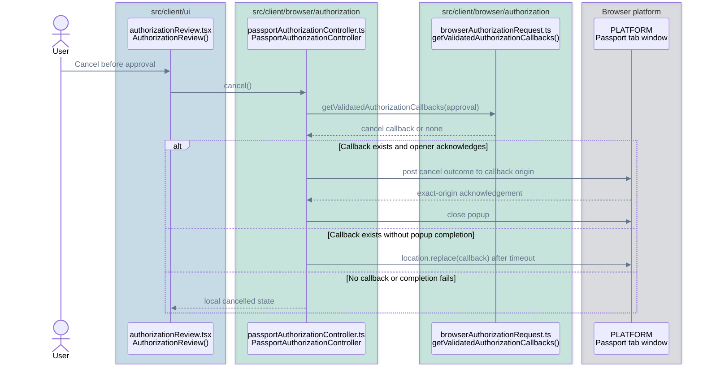

### Single Google Implicit Popup Flow

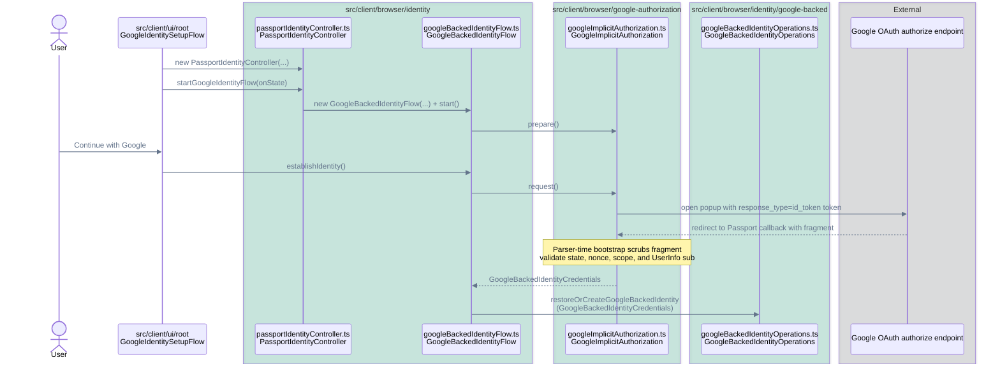


### Restore Or Create Google-Backed Identity

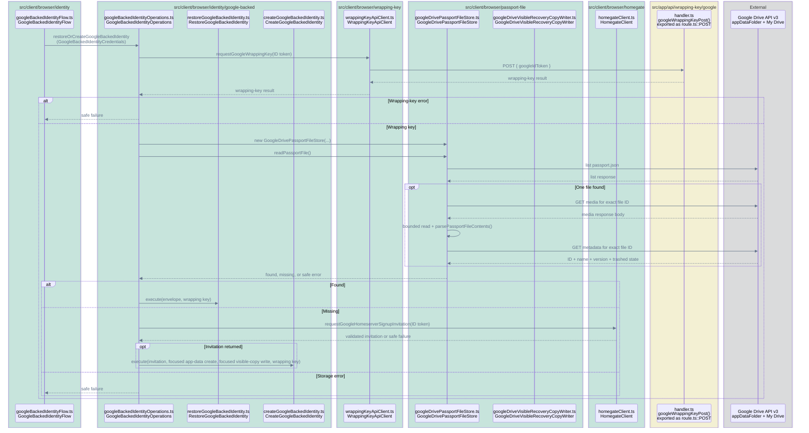


### Restore Existing Identity

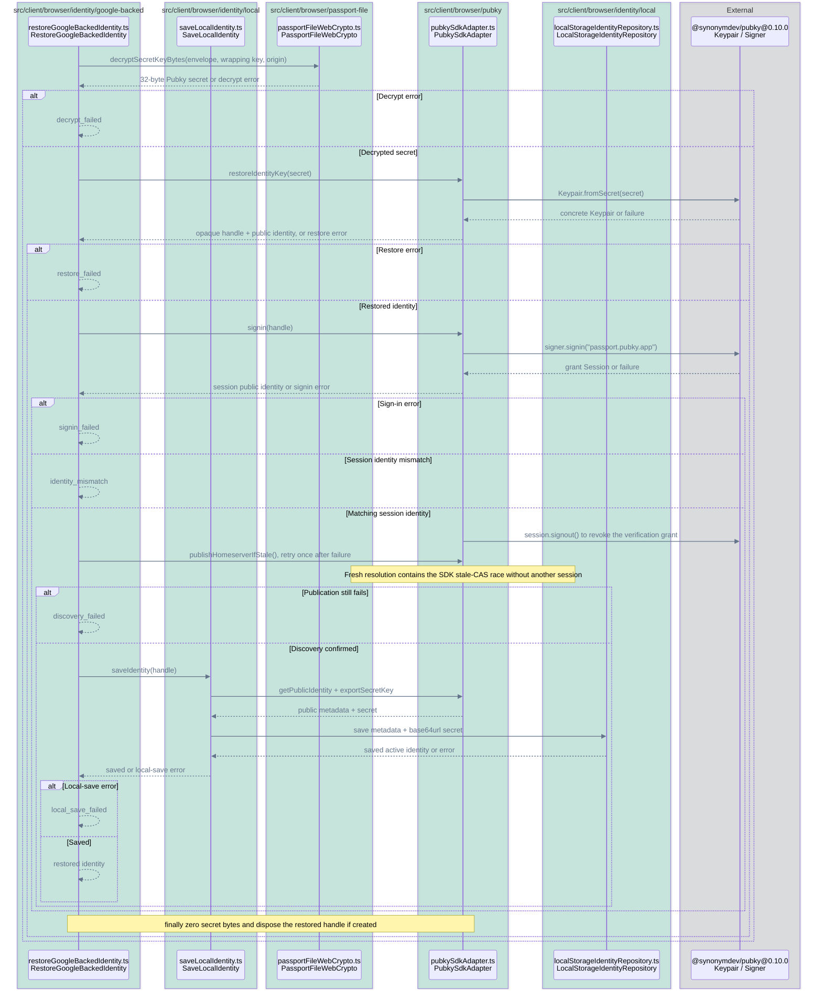

### Create Missing Identity: Encrypt And Store

```mermaid
%%{init: {"themeVariables": {"signalColor": "#64748B", "signalTextColor": "#64748B"}}}%%
sequenceDiagram
    accTitle: Missing identity encryption and Drive storage call flow
    accDescr: CreateGoogleBackedIdentity encrypts a new Pubky secret, creates the operational app-data file through GoogleDrivePassportFileStore, then best-effort writes a visible recovery copy through GoogleDriveVisibleRecoveryCopyWriter before activation and zeros the exported bytes.
    box rgba(0, 158, 115, 0.18) src/client/browser/identity/google-backed
        participant Creator as createGoogleBackedIdentity.ts<br/>CreateGoogleBackedIdentity
    end
    box rgba(0, 158, 115, 0.18) src/client/browser/pubky
        participant Pubky as pubkySdkAdapter.ts<br/>PubkySdkAdapter
    end
    box rgba(0, 158, 115, 0.18) src/client/browser/passport-file
        participant Crypto as passportFileWebCrypto.ts<br/>PassportFileWebCrypto
        participant DriveStore as googleDrivePassportFileStore.ts<br/>GoogleDrivePassportFileStore
        participant VisibleWriter as googleDriveVisibleRecoveryCopyWriter.ts<br/>GoogleDriveVisibleRecoveryCopyWriter
    end
    box rgba(17, 24, 39, 0.12) External
        participant SDK as @synonymdev/pubky@0.10.0<br/>Keypair
        participant Drive as Google Drive API v3<br/>appDataFolder/passport.json
    end

    Creator->>Pubky: createIdentityKey()
    Pubky->>SDK: Keypair.random()
    SDK-->>Pubky: concrete Keypair
    Pubky-->>Creator: opaque handle + public identity
    Creator->>Pubky: exportSecretKey(handle)
    Pubky-->>Creator: 32-byte secret
    Creator->>Crypto: encryptSecretKeyBytes(secret, wrapping key, origin)
    Crypto-->>Creator: encrypted envelope
    Creator->>DriveStore: createPassportFile(envelope)
    DriveStore->>Drive: pre-list passport.json
    Drive-->>DriveStore: pre-list response
    break Pre-list error
        Note over DriveStore: Preserve authorization, network, or response error
    end
    break Existing or duplicate
        Note over DriveStore: Result is create_conflict
    end
    DriveStore->>Drive: create-only multipart POST
    Drive-->>DriveStore: create response
    break Create failed or response malformed
        Note over DriveStore: Return write or invalid-response error
    end
    DriveStore->>Drive: post-list passport.json
    Drive-->>DriveStore: post-list response
    DriveStore-->>Creator: operational write completed or safe error
    Creator->>VisibleWriter: createVisibleRecoveryCopy(envelope, public Pubky)
    VisibleWriter->>Drive: find or create My Drive/Pubky Passport
    Drive-->>VisibleWriter: visible folder response
    VisibleWriter->>Drive: create-only {pubky}.json copy
    Drive-->>VisibleWriter: visible copy response
    VisibleWriter->>Drive: verify exact created file ID and revision
    Drive-->>VisibleWriter: exact metadata, parent, and trashed state
    Note over DriveStore,VisibleWriter: Operational reads and deletion remain appDataFolder-only
    VisibleWriter-->>Creator: confirmed creation or safe unconfirmed outcome
    Note over Creator: Zero exported secret bytes
    alt Operational storage error
        Creator->>Pubky: disposeIdentityKey(handle)
    else Visible copy warning
        Note over Creator: Continue activation; do not strand an unsigned-up appData identity
    else Stored
        Note over Creator: Key handle continues into activation
    end
```

### Create Missing Identity: Activate And Save


Local ready state is saved last. Setup cannot be atomic across Drive, Homegate,
homeserver signup, and discovery. A definite homeserver signup invitation failure
occurs before Passport file creation. After signup or discovery has been attempted,
Passport preserves the encrypted Passport file so the key is not lost, disposes the
key handle, and saves no ready local Pubky identity; it must not automatically delete the
file. `preservedPassportFileIdentity` may carry only public identity metadata after
creation stores the encrypted file or restore successfully decrypts it. This does not
prove setup was partial. The explicit resume path obtains fresh Google credentials,
restores and verifies that same encrypted key, requests a new Homegate invitation, and
reuses normal signup, discovery, and local activation without deleting the backup or
creating a replacement key.

### Detach from Google

Detachment uses the same single Google implicit popup flow as setup. The selected
Google account must match the account stored on the local identity before any Drive
request is made.

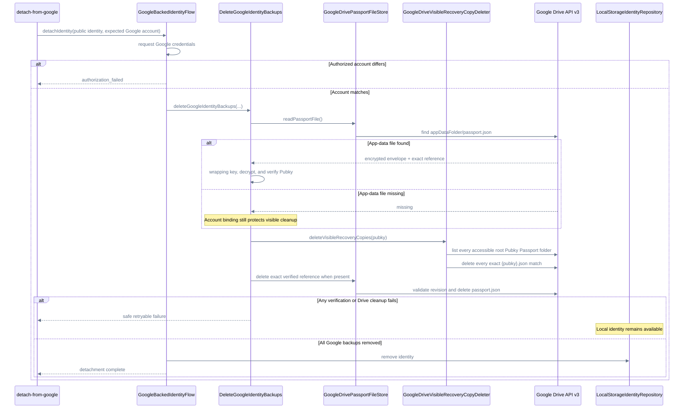

## Server APIs

### Wrapping Key

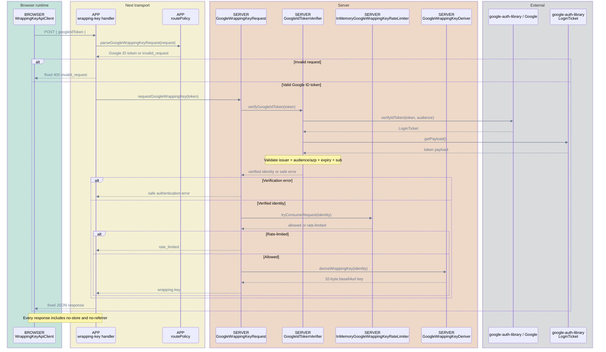

### Homegate Signup Invitation

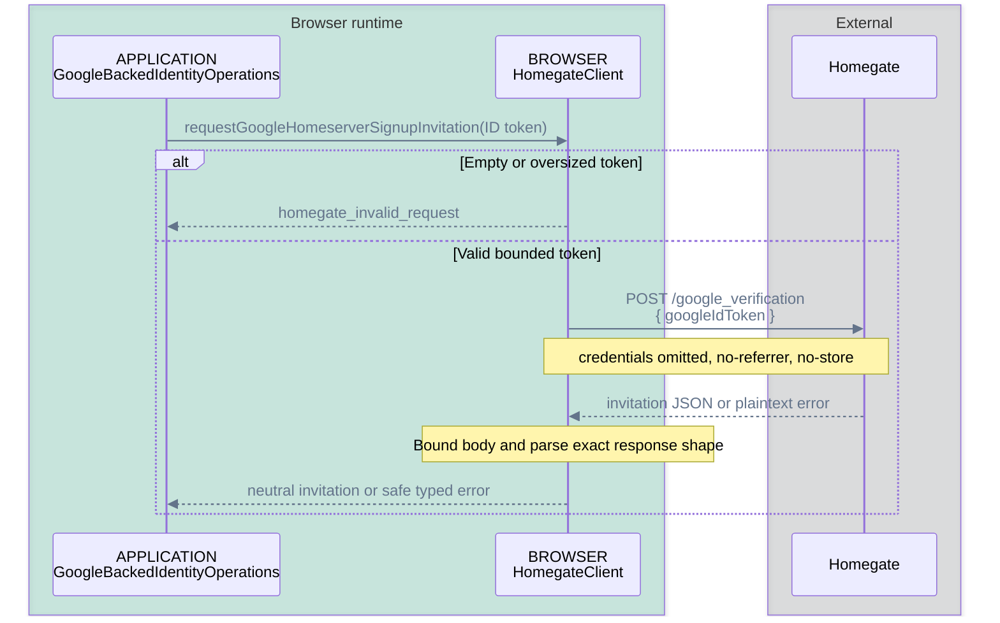

## Reviewer Index

| Flow | Code | Main tests |
| --- | --- | --- |
| Authorization parser | `src/client/browser/authorization` | Colocated parser and URL validation tests |
| Authorization controller and approval | `src/client/browser/authorization` | Colocated request, controller, composition, and approval tests |
| Authorization browser entry | `src/client/browser/authorization/browserAuthorizationEntry.ts` | `browserAuthorizationEntry.test.ts` |
| Authorization UI | `src/client/ui/authorization` | Colocated component tests |
| Identity controller | `src/client/browser/identity` | Controller and factory tests |
| Google credential capabilities | `src/client/browser/google-authorization` | Colocated implicit OAuth and callback-scrubbing tests |
| Google-backed custody/recovery lifecycle | `src/client/browser/identity/google-backed` | Colocated operation tests |
| Drive store and WebCrypto | `src/client/browser/passport-file` | Colocated store and crypto tests |
| Pubky SDK adapter | `src/client/browser/pubky/pubkySdkAdapter.ts` | `pubkySdkAdapter.test.ts` |
| Wrapping-key API | `src/app/api/wrapping-key/google`, `src/server/wrapping-key/google` | Route and server tests |
| Browser bootstrap config | `src/server/config/browserBootstrapConfig.ts` | `browserBootstrapConfig.test.ts`, proxy tests |
| Homegate signup invitation | `src/client/browser/homegate/homegateClient.ts` | `homegateClient.test.ts` |
| CSP and boundaries | `proxy.ts`, `next.config.mjs`, architecture test | Proxy, header, and targeted boundary tests |
