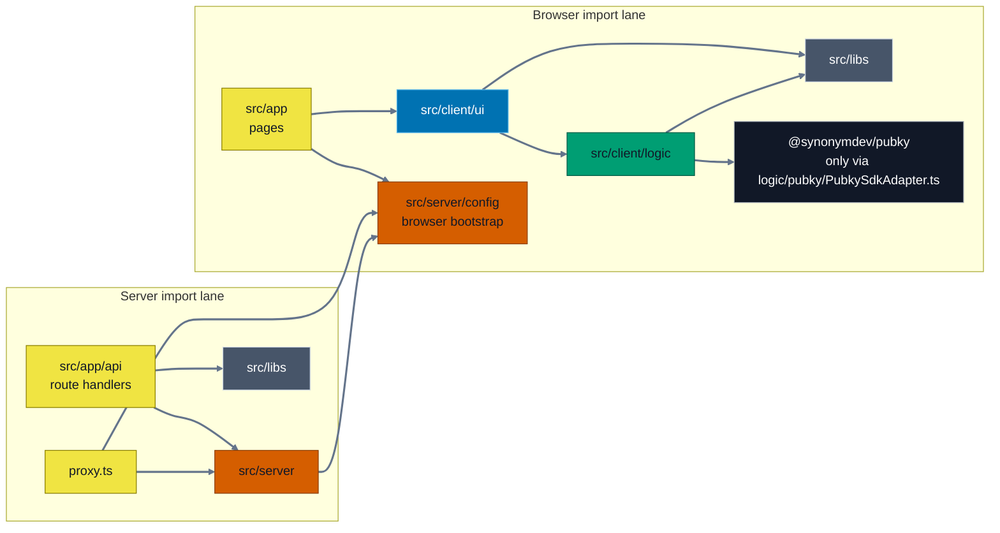
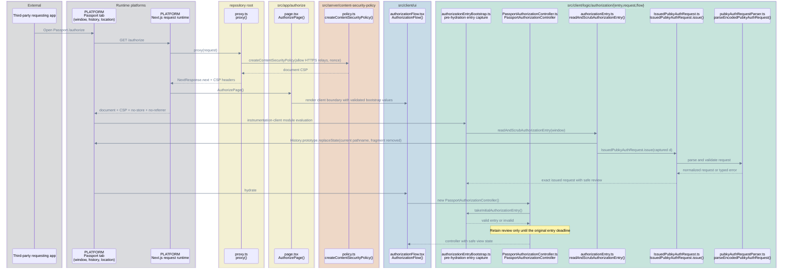
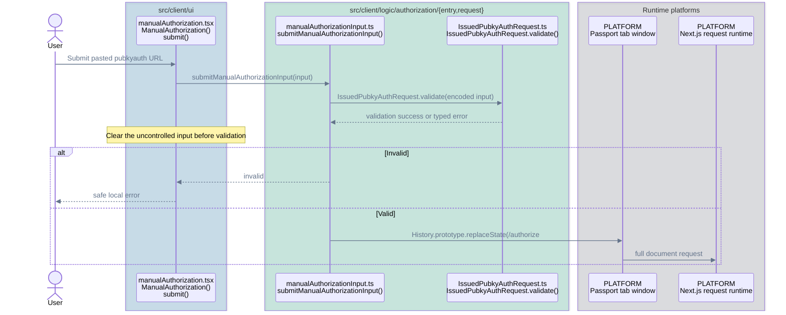
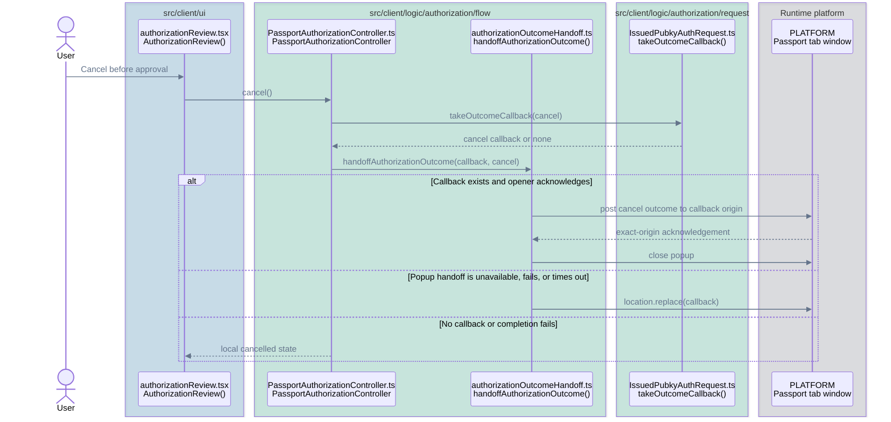
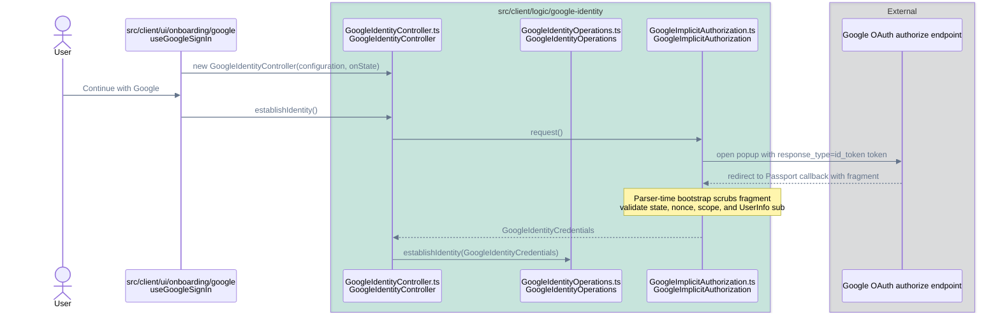
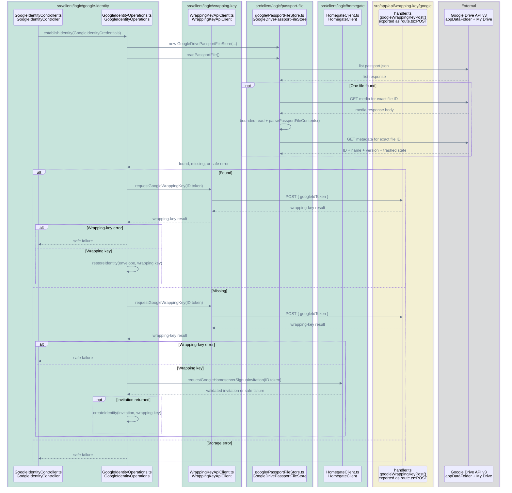
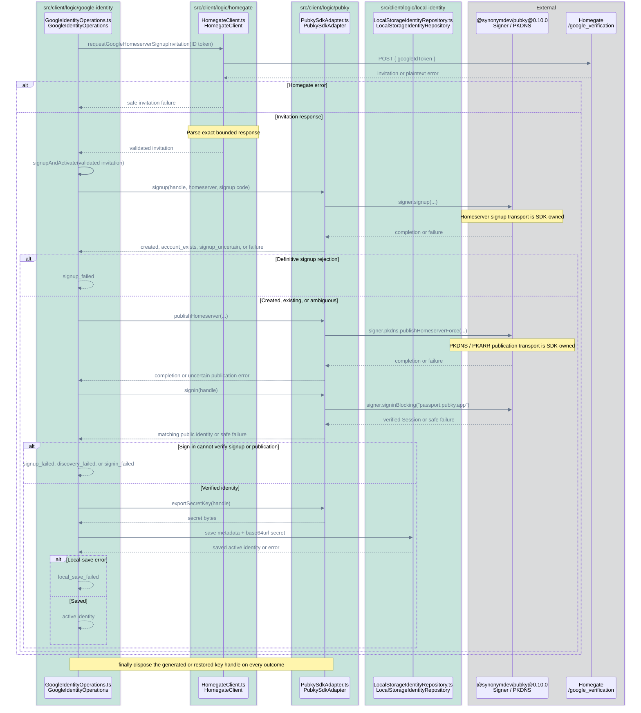
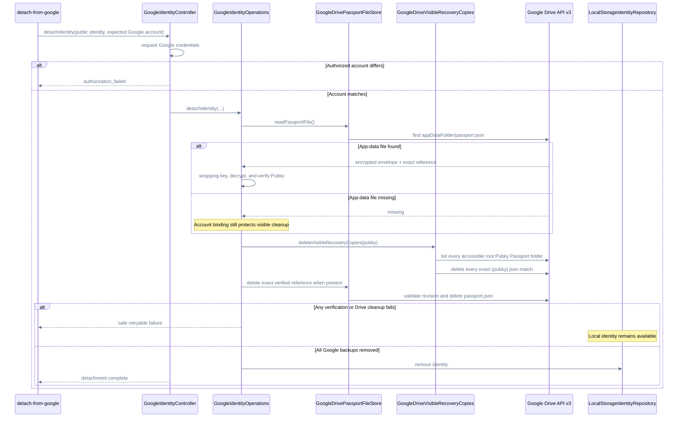
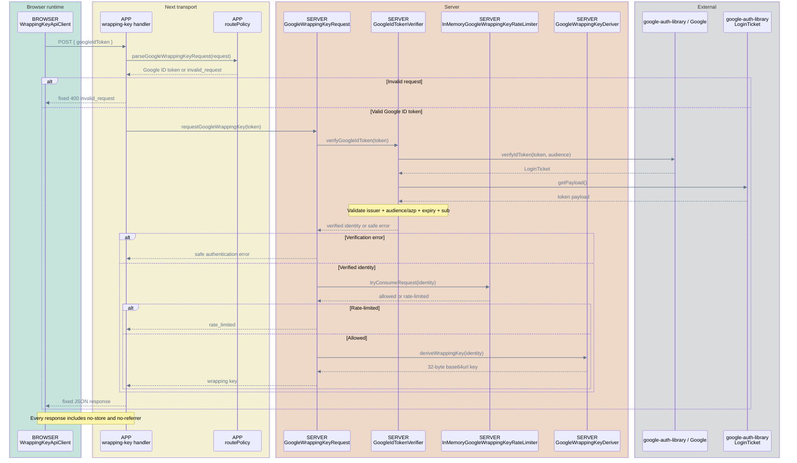
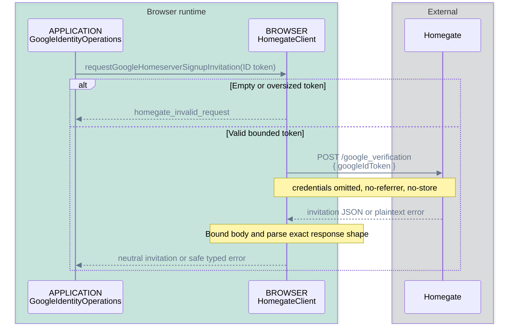

# Runtime Flows

Current implementation. The home route is a development identity surface;
`/authorize` includes capability review, local Pubky identity selection, the
Google-backed custody/recovery strategy, approval, cancellation, callbacks, and
local terminal states.


## Import Boundaries

Arrows in this diagram only mean direct imports in current production code.



ESLint, `test-utils/architecture/architecture-boundaries.test.ts`, and the
`client-only` / `server-only` markers enforce targeted runtime and security
boundaries. These include browser/server isolation, approved environment access,
SDK and persistence confinement, secret-bearing UI
capability confinement, and sensitive parser contract confinement. Feature-internal
folder roles are not enforced.

## Routes

| Route | Entry | Responsibility |
| --- | --- | --- |
| `/` | `src/app/page.tsx::Home` | Development identity panel and manual auth entry. |
| `/authorize` | `src/app/authorize/page.tsx::AuthorizePage` | Review, approve, cancel, callbacks. |
| `POST /api/wrapping-key/google` | `src/app/api/wrapping-key/google/route.ts::POST` | Verify provider-account claims and derive a wrapping key. |

## Call Flows

In the remaining diagrams:

- Solid arrow: call or network request.
- Dashed arrow: return or result.

### `/authorize` Document Entry




### Manual Authorization



### Approval

```mermaid
%%{init: {"themeVariables": {"signalColor": "#64748B", "signalTextColor": "#64748B"}}}%%
sequenceDiagram
    accTitle: Authorization approval call flow
    accDescr: Passport restores the identity shown during review, asks the Pubky SDK to deliver approval, disposes key resources, and then resolves the validated outcome callback.
    actor User
    box rgba(0, 114, 178, 0.18) src/client/ui
        participant Review as authorizationReview.tsx<br/>AuthorizationReview()
    end
    box rgba(0, 158, 115, 0.18) src/client/logic/authorization/flow
        participant Controller as PassportAuthorizationController.ts<br/>PassportAuthorizationController
        participant UseCase as approveAuthorization.ts<br/>approveAuthorization()
        participant Handoff as authorizationOutcomeHandoff.ts<br/>handoffAuthorizationOutcome()
    end
    box rgba(0, 158, 115, 0.18) src/client/logic/authorization/request
        participant AuthRequest as IssuedPubkyAuthRequest.ts<br/>validatedUrlForApproval()<br/>takeOutcomeCallback()
    end
    box rgba(0, 158, 115, 0.18) src/client/logic/local-identity
        participant Repo as LocalStorageIdentityRepository.ts<br/>LocalStorageIdentityRepository
    end
    box rgba(0, 158, 115, 0.18) src/client/logic/pubky
        participant Pubky as PubkySdkAdapter.ts<br/>PubkySdkAdapter
    end
    box rgba(17, 24, 39, 0.12) External
        participant SDK as @synonymdev/pubky@0.10.0<br/>Keypair / Signer
        participant Relay as Request-supplied HTTPS Relay<br/>Signer.approveAuthRequest() delivery
    end
    box rgba(107, 114, 128, 0.18) Runtime platform
        participant Window as PLATFORM<br/>Passport tab window
    end

    User->>Review: Approve
    Review->>Controller: approve(displayed publicKeyZ32)
    Controller->>UseCase: approveAuthorization(issued request, publicKeyZ32, expiresAt)
    UseCase->>Pubky: new PubkySdkAdapter()
    UseCase->>Repo: read(publicKeyZ32)
    Repo-->>UseCase: public metadata + 32-byte secret
    UseCase->>Pubky: restoreIdentityKey(secret)
    Pubky->>SDK: Keypair.fromSecret(secret)
    SDK-->>Pubky: concrete Keypair
    Pubky-->>UseCase: opaque handle + public identity
    Note over UseCase: Compare persisted public metadata and clear secret bytes
    Note over UseCase: Recheck the original request deadline before SDK approval
    UseCase->>Pubky: approveAuthRequest(handle, issued request)
    Pubky->>AuthRequest: isLive() + validatedUrlForApproval()
    AuthRequest-->>Pubky: exact-request provenance + sensitive URL
    Pubky->>SDK: signer.approveAuthRequest(sensitive URL)
    Note over SDK,Relay: SDK emits a legacy AuthToken for signin or a PoP-bound signed grant for signin_grant; encryption and Relay delivery remain SDK-owned
    SDK-->>Pubky: completion or failure
    Pubky-->>UseCase: typed result
    UseCase->>Pubky: disposeIdentityKey(handle)
    UseCase->>Pubky: dispose()
    UseCase-->>Controller: safe result
    Controller->>AuthRequest: takeOutcomeCallback(outcome)
    AuthRequest-->>Controller: success or error callback
    Controller->>Handoff: handoffAuthorizationOutcome(callback, outcome)
    alt Callback exists and opener acknowledges
        Handoff->>Window: post finite outcome to callback origin
        Window-->>Handoff: exact-origin acknowledgement
        Handoff->>Window: close popup
    else Popup handoff is unavailable, fails, or times out
        Handoff->>Window: location.replace(callback)
    else No callback or completion fails
        Controller-->>Review: safe local terminal state
    end
```

### Cancellation



### Single Google Implicit Popup Flow




### Restore Or Create Google-Backed Identity




### Restore Existing Identity

Identity establishment reports discriminated progress as `{ flow, step }`. The
`lookup`, `create`, `restore`, and `repair` flows each expose only their valid steps,
so the UI cannot receive an invalid cross-flow phase combination.

```mermaid
%%{init: {"themeVariables": {"signalColor": "#64748B", "signalTextColor": "#64748B"}}}%%
sequenceDiagram
    accTitle: Existing identity restore call flow
    accDescr: GoogleIdentityOperations decrypts the Passport file and tries normal blocking sign-in first, then uses Homegate signup to distinguish a missing account from an existing account before publishing PKDNS and verifying sign-in.
    box rgba(0, 158, 115, 0.18) src/client/logic/google-identity
        participant Operations as GoogleIdentityOperations.ts<br/>GoogleIdentityOperations
    end
    box rgba(0, 158, 115, 0.18) src/client/logic/passport-file
        participant Crypto as PassportFileWebCrypto.ts<br/>PassportFileWebCrypto
    end
    box rgba(0, 158, 115, 0.18) src/client/logic/pubky
        participant Pubky as PubkySdkAdapter.ts<br/>PubkySdkAdapter
    end
    box rgba(0, 158, 115, 0.18) src/client/logic/local-identity
        participant Repo as LocalStorageIdentityRepository.ts<br/>LocalStorageIdentityRepository
    end
    box rgba(17, 24, 39, 0.12) External
        participant SDK as @synonymdev/pubky@0.10.0<br/>Keypair / Signer
    end

    Operations->>Crypto: decryptSecretKeyBytes(envelope, wrapping key, origin)
    Crypto-->>Operations: 32-byte Pubky secret or decrypt error
    alt Decrypt error
        Operations-->>Operations: decrypt_failed
    else Decrypted secret
        Operations->>Pubky: restoreIdentityKey(secret)
        Pubky->>SDK: Keypair.fromSecret(secret)
        SDK-->>Pubky: concrete Keypair or failure
        Pubky-->>Operations: opaque handle + public identity, or restore error
        alt Restore error
            Operations-->>Operations: restore_failed
        else Restored identity
            Operations->>Pubky: signin(handle)
            Pubky->>SDK: signer.signinBlocking("passport.pubky.app")
            SDK-->>Pubky: grant Session or safe failure
            opt Normal sign-in fails
                Operations->>Operations: request Homegate invitation<br/>and run shared signupAndActivate()
                Note over Operations,Pubky: Signup success creates the account;<br/>account_exists confirms it exists;<br/>signup_uncertain is verified by final sign-in
                Note over Operations,Pubky: Reuse the restored key for explicit<br/>publication and final sign-in
            end
            alt Session identity mismatch
                Operations-->>Operations: identity_mismatch
            else Matching verified identity
                Operations->>Pubky: exportSecretKey(handle)
                Pubky-->>Operations: secret bytes
                Operations->>Repo: save metadata + base64url secret
                Repo-->>Operations: saved active identity or error
                alt Local-save error
                    Operations-->>Operations: local_save_failed
                else Saved
                    Operations-->>Operations: restored identity
                end
            end
        end
        Note over Operations,Pubky: finally zero secret bytes and dispose the restored handle if created
    end
    end
```

### Create Missing Identity: Encrypt And Store

```mermaid
%%{init: {"themeVariables": {"signalColor": "#64748B", "signalTextColor": "#64748B"}}}%%
sequenceDiagram
    accTitle: Missing identity encryption and Drive storage call flow
    accDescr: GoogleIdentityOperations encrypts a new Pubky secret, creates the operational app-data file through GoogleDrivePassportFileStore, then best-effort writes a visible recovery copy through GoogleDriveVisibleRecoveryCopies before activation and zeros the exported bytes.
    box rgba(0, 158, 115, 0.18) src/client/logic/google-identity
        participant Operations as GoogleIdentityOperations.ts<br/>GoogleIdentityOperations
    end
    box rgba(0, 158, 115, 0.18) src/client/logic/pubky
        participant Pubky as PubkySdkAdapter.ts<br/>PubkySdkAdapter
    end
    box rgba(0, 158, 115, 0.18) src/client/logic/passport-file
        participant Crypto as PassportFileWebCrypto.ts<br/>PassportFileWebCrypto
        participant DriveStore as google/PassportFileStore.ts<br/>GoogleDrivePassportFileStore
        participant VisibleCopies as google/VisibleRecoveryCopies.ts<br/>GoogleDriveVisibleRecoveryCopies
    end
    box rgba(17, 24, 39, 0.12) External
        participant SDK as @synonymdev/pubky@0.10.0<br/>Keypair
        participant Drive as Google Drive API v3<br/>appDataFolder/passport.json
    end

    Operations->>Pubky: createIdentityKey()
    Pubky->>SDK: Keypair.random()
    SDK-->>Pubky: concrete Keypair
    Pubky-->>Operations: opaque handle + public identity
    Operations->>Pubky: exportSecretKey(handle)
    Pubky-->>Operations: 32-byte secret
    Operations->>Crypto: encryptSecretKeyBytes(secret, wrapping key, origin)
    Crypto-->>Operations: encrypted envelope
    Operations->>DriveStore: createPassportFile(envelope)
    DriveStore->>Drive: pre-list passport.json
    Drive-->>DriveStore: pre-list response
    break Pre-list error
        Note over DriveStore: Preserve authorization, network, or response error
    end
    break Existing or duplicate
        Note over DriveStore: Result is create_conflict
    end
    DriveStore->>Drive: create-only multipart POST
    Drive-->>DriveStore: create response
    break Create failed or response malformed
        Note over DriveStore: Return write or invalid-response error
    end
    DriveStore->>Drive: post-list passport.json
    Drive-->>DriveStore: post-list response
    DriveStore-->>Operations: operational write completed or safe error
    Operations->>VisibleCopies: createVisibleRecoveryCopy(envelope, public Pubky)
    VisibleCopies->>Drive: find or create My Drive/Pubky Passport
    Drive-->>VisibleCopies: visible folder response
    VisibleCopies->>Drive: create-only {pubky}.json copy
    Drive-->>VisibleCopies: visible copy response
    VisibleCopies->>Drive: verify exact created file ID and revision
    Drive-->>VisibleCopies: exact metadata, parent, and trashed state
    Note over DriveStore,VisibleCopies: Operational reads and deletion remain appDataFolder-only
    VisibleCopies-->>Operations: confirmed creation or safe unconfirmed outcome
    Note over Operations: Zero exported secret bytes
    alt Operational storage error
        Operations->>Pubky: disposeIdentityKey(handle)
    else Visible copy warning
        Note over Operations: Continue activation; do not strand an unsigned-up appData identity
    else Stored
        Note over Operations: Key handle continues into activation
    end
```

### Create Missing Identity: Activate And Save



Local ready state is saved last. Setup cannot be atomic across Drive, Homegate,
homeserver signup, and discovery. A definite homeserver signup invitation failure
occurs before Passport file creation. After signup or discovery has been attempted,
Passport preserves the encrypted Passport file so the key is not lost, disposes the
key handle, and saves no ready local Pubky identity; it must not automatically delete
the file. A later normal establishment retry restores that same key. Restore first
attempts normal sign-in. After a failed sign-in, automatic homeserver reconciliation
only starts when PKDNS resolution definitively confirms that no homeserver record exists.
An existing record or uncertain resolution fails without requesting another invitation.
Exact signup `409` confirms the account already exists; successful signup creates a
missing account; an uncertain signup result is verified by final sign-in. The
Homegate homeserver is then force-published and
blocking sign-in must verify the account and identity before local activation. A
publication error is treated as uncertain because a relay may have accepted the
record; successful blocking sign-in confirms it without requiring another user retry.

### Detach from Google

Detachment uses the same single Google implicit popup flow as setup. The selected
Google account must match the account stored on the local identity before any Drive
request is made.



## Server APIs

### Wrapping Key



### Homegate Signup Invitation



## Reviewer Index

| Flow | Code | Main tests |
| --- | --- | --- |
| Authorization request model | `src/client/logic/authorization/request/IssuedPubkyAuthRequest.ts` | Issuance, parser, capability, and URL tests |
| Authorization controller and approval | `src/client/logic/authorization/flow` | Controller, approval, and outcome handoff tests |
| Authorization entry | `src/client/logic/authorization/entry/authorizationEntry.ts` | `authorizationEntry.test.ts` |
| Authorization UI | `src/client/ui/authorization` | Colocated component tests |
| Local identity controller | `src/client/logic/local-identity` | Controller and repository tests |
| Google OAuth and custody/recovery lifecycle | `src/client/logic/google-identity` | Colocated authorization, flow, and operation tests |
| Drive store and WebCrypto | `src/client/logic/passport-file` | Colocated store and crypto tests |
| Pubky SDK adapter | `src/client/logic/pubky/PubkySdkAdapter.ts` | `pubkySdkAdapter.test.ts` |
| Wrapping-key API | `src/app/api/wrapping-key/google`, `src/server/wrapping-key/google` | Route and server tests |
| Browser bootstrap config | `src/server/config/browserBootstrapConfig.ts` | `browserBootstrapConfig.test.ts`, proxy tests |
| Homegate signup invitation | `src/client/logic/homegate/HomegateClient.ts` | `homegateClient.test.ts` |
| CSP and boundaries | `proxy.ts`, `next.config.mjs`, architecture test | Proxy, header, and targeted boundary tests |
