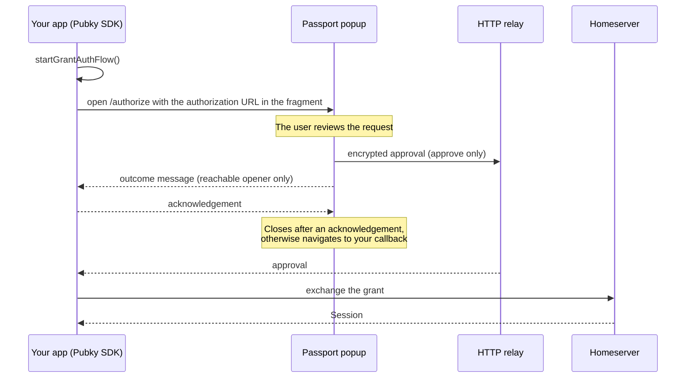

# Integrating with Pubky Passport

Pubky Passport approves authorization requests created by the Pubky SDK. Your app creates a
request, opens Passport, and waits for the SDK to receive the approval through the relay.

> Authenticate the user only after the Pubky SDK returns a `Session`. Passport callbacks and
> messages describe the UI outcome; they are not credentials.

## Flow



1. Your app starts a grant auth flow and receives `flow.authorizationUrl`.
2. Your app opens Passport with that URL in the fragment of `/authorize`.
3. The user approves or cancels in Passport. On approval, Passport posts the encrypted approval to
   the relay before it reports the outcome to your app.
4. The SDK receives the approval, exchanges it with the homeserver, and returns a `Session`.

The authorization URL contains the relay secret. Keep it in the browser, encode it exactly once,
and never log it or send it to analytics.

## Popup sign-in

Install the SDK:

```bash
pnpm add @synonymdev/pubky
```

Call `signInWithPassport()` directly from a click or tap handler, and run one attempt at a time,
for example by disabling the button while an attempt is pending. The popup opens before the first
`await`, otherwise the browser may block it.

```ts
import { AuthFlowKind, Pubky, type GrantAuthFlow, type Session } from "@synonymdev/pubky";

const PASSPORT_ORIGIN = "https://passport.pubky.app";
const CAPABILITIES = "/pub/example.app/:rw";
const CLIENT_ID = "example.app";
const CALLBACK_PATH = "/auth/passport/return";
export const CALLBACK_MESSAGE = "example.app.passport-return";
const TIMEOUT_MS = 5 * 60_000;
const POLL_INTERVAL_MS = 250;

const pubky = new Pubky();

type Outcome = "success" | "error" | "cancel";

export async function signInWithPassport(): Promise<Session> {
  const popup = window.open(
    "about:blank",
    `pubky-passport-${crypto.randomUUID()}`,
    "popup,width=520,height=760",
  );
  if (!popup) throw new Error("Passport popup was blocked");

  let outcome: Outcome | undefined;
  const onMessage = (event: MessageEvent<unknown>) => {
    const received = readOutcome(event, popup);
    if (received) outcome = received;
  };
  window.addEventListener("message", onMessage);

  try {
    const flow = await pubky.startGrantAuthFlow(CAPABILITIES, AuthFlowKind.signin(), {
      clientId: CLIENT_ID,
      xCallback: {
        xSource: "Example App",
        xSuccess: callbackUrl("success"),
        xError: callbackUrl("error"),
        xCancel: callbackUrl("cancel"),
      },
    });
    popup.location.replace(
      `${PASSPORT_ORIGIN}/authorize#d=${encodeURIComponent(flow.authorizationUrl)}`,
    );

    return await waitForSession(flow, () => {
      if (outcome === "cancel") return "Passport authorization was cancelled";
      if (outcome === "error") return "Passport could not approve the request";
      // After a `success` message Passport closes the popup itself; keep polling for the relay.
      if (popup.closed && outcome !== "success") return "Passport popup was closed";
      return undefined;
    });
  } finally {
    window.removeEventListener("message", onMessage);
    closePopup(popup);
  }
}

/**
 * Polls until a session arrives, the deadline passes, or `interruption()` returns a reason.
 * `awaitApproval()` cannot be interrupted, so popup attempts poll with `tryPollOnce()` instead.
 */
async function waitForSession(
  flow: GrantAuthFlow,
  interruption: () => string | undefined,
): Promise<Session> {
  try {
    const deadline = Date.now() + TIMEOUT_MS;
    while (Date.now() < deadline) {
      const reason = interruption();
      if (reason) throw new Error(reason);

      const session = await flow.tryPollOnce();
      if (session) return session;
      await new Promise((resolve) => setTimeout(resolve, POLL_INTERVAL_MS));
    }
    throw new Error("Passport authorization timed out");
  } finally {
    flow.free(); // No call is in flight here.
  }
}

/** Returns the outcome carried by a message from this attempt's popup; acknowledges Passport's. */
function readOutcome(event: MessageEvent<unknown>, popup: Window): Outcome | undefined {
  const data = event.data;
  if (event.source !== popup || !isRecord(data) || !isOutcome(data.outcome)) return undefined;

  if (event.origin === PASSPORT_ORIGIN) {
    if (
      data.type !== "pubky-passport.authorization-outcome" ||
      data.version !== 1 ||
      typeof data.messageId !== "string"
    ) {
      return undefined;
    }
    // Acknowledge so Passport closes the popup instead of navigating it to the callback.
    popup.postMessage(
      { type: "pubky-passport.authorization-outcome-ack", version: 1, messageId: data.messageId },
      PASSPORT_ORIGIN,
    );
    return data.outcome;
  }

  // Sent by the callback page when Passport fell back to navigation.
  if (event.origin === window.location.origin && data.type === CALLBACK_MESSAGE) {
    return data.outcome;
  }
  return undefined;
}

function callbackUrl(outcome: Outcome): string {
  const url = new URL(CALLBACK_PATH, window.location.origin);
  url.searchParams.set("outcome", outcome);
  return url.href;
}

function closePopup(popup: Window): void {
  try {
    if (!popup.closed) popup.close();
  } catch {
    // Closing a cross-origin popup is best effort.
  }
}

export function isOutcome(value: unknown): value is Outcome {
  return value === "success" || value === "error" || value === "cancel";
}

function isRecord(value: unknown): value is Record<string, unknown> {
  return typeof value === "object" && value !== null && !Array.isArray(value);
}
```

Replace `CAPABILITIES` and `CLIENT_ID` with values belonging to your app, and request only the
access you need. Save the returned session with `pubky.browserSessionStore.save(session)` if it
must survive a page reload.

### Ending an attempt

`flow.awaitApproval()` blocks until the relay delivers an approval. It cannot be interrupted, and a
flow must not be freed while one of its calls is pending, so a popup attempt polls with
`flow.tryPollOnce()` instead and decides between polls:

| Signal                          | Meaning                                                   | What the example does                     |
| ------------------------------- | --------------------------------------------------------- | ----------------------------------------- |
| SDK returns a `Session`         | The user is authenticated                                 | Returns it and closes the popup           |
| `success` message               | The approval reached the relay; Passport closes the popup | Keeps polling until the `Session` arrives |
| `error` or `cancel` message     | Passport could not approve, or the user declined          | Ends the attempt                          |
| Popup closed without an outcome | The user abandoned the attempt                            | Ends the attempt                          |
| SDK throws                      | Relay, network, or approval failure                       | Ends the attempt                          |
| Deadline passed                 | The user never finished                                   | Ends the attempt                          |

Every ending frees the flow, removes the message listener, and closes the popup if it is still
open. Never reuse a flow after its attempt ended; start a fresh one to retry.

## Callback page

Passport navigates the popup to your callback when it cannot deliver the outcome message: the
popup has no opener, the callback origin differs from your page's origin, or your page did not
acknowledge within three seconds. The callback page forwards the outcome to the opener and closes
the popup, reusing `CALLBACK_MESSAGE` and `isOutcome()` from the module above:

```ts
// Served at CALLBACK_PATH. The query string is an untrusted hint; it never signs the user in.
const outcome = new URLSearchParams(window.location.search).get("outcome");
const opener: Window | null = window.opener;

if (isOutcome(outcome) && opener && !opener.closed) {
  opener.postMessage({ type: CALLBACK_MESSAGE, outcome }, window.location.origin);
  window.close();
}
```

Always render a visible link back to your app, because the page may open without an opener. If
the page needs authenticated state, resume the SDK flow and wait for a `Session`.

Callbacks are optional. When present, they must be HTTPS and share one origin, otherwise Passport
rejects the whole request; omit them while developing over plain HTTP. Without callbacks, Passport
shows its own result screen in the popup, and your app learns about a cancellation only when the
popup is closed or the deadline passes.

## Outcome messages

When the popup's opener is reachable and your callbacks share its origin, Passport first posts:

```ts
type PassportOutcomeMessage = {
  type: "pubky-passport.authorization-outcome";
  version: 1;
  outcome: "success" | "error" | "cancel";
  messageId: string;
};
```

Verify `event.origin` against the exact Passport origin, confirm `event.source` is the popup of
the current attempt, and validate every field. Then acknowledge with the same `messageId`:

```ts
type PassportOutcomeAcknowledgement = {
  type: "pubky-passport.authorization-outcome-ack";
  version: 1;
  messageId: string;
};
```

Use the exact Passport origin as `targetOrigin`, never `"*"`. Passport waits up to three seconds
for the acknowledgement. Once acknowledged, it closes the popup; without an acknowledgement, it
navigates the popup to the matching callback.

A `success` message means the approval reached the relay; keep waiting for the SDK. `error` and
`cancel` end the attempt. None of these messages authenticate the user.

## Browser requirements

- Build the Passport URL as `/authorize#d=${encodeURIComponent(flow.authorizationUrl)}`. Passport
  rejects requests that carry a query string.
- Set `xSource` to a short display name of at most 128 characters. Passport shows the callback
  host separately because `xSource` is not a verified identity.
- Open the popup without `noopener` or `noreferrer`, otherwise Passport cannot message your page.
- `Cross-Origin-Opener-Policy: same-origin` on your page severs the popup: `window.opener` becomes
  `null` in Passport and your `popup` reference reports `closed`. Use `same-origin-allow-popups`
  if you need COOP.
- Allow the HTTP relay, the pkarr relays, and the homeservers the SDK contacts in your CSP
  `connect-src`.
- Do not embed Passport in an iframe; it sends `frame-ancestors 'none'`.

## Same-tab navigation

Passport also works without a popup. Before navigating the current page to Passport, save the
pending flow with `flow.saveLocal()` in `sessionStorage`. Passport returns by navigating to your
callback because there is no opener. On the callback page, resume with
`pubky.resumeGrantAuthFlow(savedState)` when the outcome hint is `success`, wait for the
`Session` with the same polling loop, and delete the saved state as soon as the flow completes or
is abandoned. Never use `localStorage`: the saved state contains the relay secret and
Proof-of-Possession key material.

## Integration checklist

Test at least these cases before shipping:

- Approval returns a `Session`, and the popup closes.
- A `success` message alone does not sign the user in.
- `error` and `cancel` end the attempt without a session.
- Closing the popup ends the attempt.
- A blocked popup fails immediately with a clear message.
- Without an acknowledgement, the callback page closes the popup and the attempt ends.
- Messages from other origins or windows are ignored.
- The deadline ends the attempt and frees the flow.
- A second click during a pending attempt does not start a second one.
