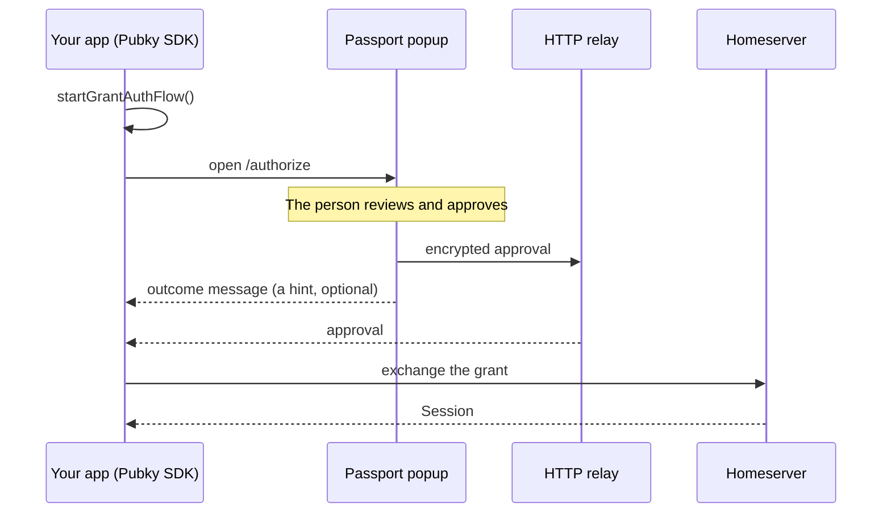

# Add Pubky Passport sign-in to your app

Pubky Passport signs people in to Pubky apps with the identity they keep in the browser or in
Pubky Ring. Add the `@pubky/passport-client` button to your page: it opens Passport, the person
approves your request there, and your app receives a real Pubky SDK `Session` with the capabilities
it asked for, the person's public key and their pubky.app profile.

> Only an SDK `Session` authenticates the user. Passport's messages, callbacks and pop-up outcomes
> describe what happened in the UI; they are not credentials.

Version 0.1.0 is ready to publish but not on npm yet. Once it is, install it with
`npm install @pubky/passport-client`; until then, build it from this repository
(`pnpm --filter @pubky/passport-client build`) and depend on its folder,
`packages/passport-client`. If you cannot use the package, the raw protocol is documented under
[Advanced: custom integrations](#advanced-custom-integrations).

## Quick start

Add the two peers the package uses, the Pubky SDK and `pubky-app-specs`:

```bash
pnpm add @synonymdev/pubky pubky-app-specs
```

Put the element on the page and listen for its one event:

```html
<pubky-passport app-name="Example App" capabilities="/pub/example.app/:rw"></pubky-passport>
<script type="module">
  import "@pubky/passport-client/element";
  const button = document.querySelector("pubky-passport");
  button.addEventListener("passport-session", (event) => {
    const { session, publicKey, profile, instance } = event.detail; // the Session is yours
  });
</script>
```

That is the whole sign-in. The button signs in with the public Passport at
`https://passport.pubky.app` unless you set `instance`, and by default it finishes only once the
person has a pubky.app profile. Set the attributes before the element joins the page (see
[After sign-in](#after-sign-in)). In React or Next.js, import the element module on the client only;
the [package README](../packages/passport-client/README.md) has a component.

## Options

The element's attributes and the headless client's options are the same settings:

| Attribute      | Option              | Default                      | Meaning                                                                     |
| -------------- | ------------------- | ---------------------------- | --------------------------------------------------------------------------- |
| `instance`     | `instance`          | `https://passport.pubky.app` | The Passport to sign in with (an HTTPS origin)                              |
| `app-name`     | `appName`           | the page's host name         | The name Passport shows                                                     |
| `client-id`    | `clientId`          | the page's host name         | A stable ID for your app, part of the request                               |
| `capabilities` | `capabilities`      | `""` (identity only)         | What the Session may do, e.g. `/pub/example.app/:rw`                        |
| `profile`      | `profile`           | `required`                   | `optional` also signs in people without a pubky.app profile                 |
| `messages`     | `messages`          | English                      | Replacement texts by message key (JSON for the attribute)                   |
| `network`      | `network`           | `mainnet`                    | `testnet` signs in on a Pubky testnet; needs both relays below              |
| `pkarr-relays` | `pkarrRelays`       | the SDK's public relays      | PKARR relay URLs, comma-separated (the option also takes a list)            |
| `http-relay`   | `httpRelay`         | the SDK's public relay       | The HTTP relay inbox of the sign-in request                                 |
| `variant`      | (element only)      | `small`                      | `large` adds a keychain QR code and an "Open keychain app" link             |
| `sync-group`   | (element only)      | none                         | Elements with the same name and settings share one sign-in (package README) |
| `entry`        | `signIn({ entry })` | none (Passport: Sign in)     | The Passport screen to open on: `join`, `google` or `sign-in`               |

Ask only for the access you need. The roots `/`, `/pub`, `/pub/`, `/priv` and `/priv/` are
refused; a folder below them, such as `/pub/example.app/` or `/priv/example.app/`, is allowed. People can pick another Passport in the element's settings; that choice is
kept for your origin only; `getPassportInstance(defaultInstance?)` returns it (or your default)
for links such as "Edit profile". Changing `instance`, `app-name`, `client-id`, `capabilities`,
`profile`, `network`, `pkarr-relays` or `http-relay` starts over with the new settings; changing
`messages` only changes the texts. `entry` and `variant` are not settings: elements in one
`sync-group` may differ in them.

**Entries.** Passport's onboarding has three first screens, and your buttons can open the one they
stand for: `entry="join"` ("Join now": create an account, Passport's **Join** screen),
`entry="google"` ("Continue with Google": the Google sign-in, without Join) and `entry="sign-in"`
(returning people). For someone Passport cannot sign in yet, the request's start page (with
`sign-in`, `join` or no entry) is Join with "Have a recovery file? Import it" and, unless your
hello carries `keychain` (your large element shows its code or "Open keychain app"), "Use Pubky
Ring or Bitkit". An element with an entry is named after it while nothing runs ("Join Pubky",
"Continue with Google", "Sign in with Pubky"; `label.join`, `label.google`, `label.sign-in` in
`messages`; your own `label.idle` stays the label where you set no `label.<entry>`), and
`entry="google"` shows Google's "G" (`::part(icon)`); a `slot="help"` child sits inside the pill
for your "?". The entry is a hint for the first screen only: it grants nothing and is not part of
the request.

**Classic QR.** Pubky Ring older than 2.0 approves only the legacy cookie sign-in. The large style
shows a switch **Older Pubky Ring? Classic QR** under its code; on, every request the
client makes (its QR code and Passport's pop-up) is the legacy kind, and a prepared code is
replaced at once. The choice is kept per device in your origin's storage; it is off by default
(Pubky Ring 2.0 and Bitkit approve grants, and Bitkit refuses the legacy kind). Headless apps read
`view.classicQr` and call `client.setClassicQr(on)`. A classic sign-in delivers a cookie `Session`
instead of a grant-backed one; it authenticates the same way, but cannot be listed or revoked on
its own, and a pop-up blocked in classic mode cannot continue in the same tab (the QR code still
works).

A testnet app sets `network="testnet"` with its PKARR relays (`https://…/pkarr`, no trailing slash
needed) and its HTTP relay inbox (`https://…/relay/inbox`), and signs in with a Passport instance
that runs on the same testnet (`PUBKY_NETWORK=testnet`). Relay URLs are HTTPS, or plain HTTP on
`localhost`, `127.0.0.1` or `[::1]`; there are no implicit testnet defaults. A Passport on the other
network refuses the request, and the sign-in fails with the code `network_mismatch`.

A bad option makes `createPassportClient` throw an error whose `name` is `"PassportConfigError"`;
its `issues` list `{ option, code, message }` for each invalid option, without echoing the value.
The type is exported as `PassportConfigError`. An element with a bad attribute shows "Passport
button not configured" instead of the button.

## Your own button (headless)

```ts
import { createPassportClient } from "@pubky/passport-client";

const client = createPassportClient({
  appName: "Example App",
  capabilities: "/pub/example.app/:rw",
});
client.subscribe((view) => {
  button.textContent = view.label; // also view.status, view.tone, view.busy
  if (view.signedIn) keep(view.signedIn); // { session, publicKey, profile, instance }
});
button.onclick = () => client.signIn(); // call it from the click: it opens Passport
joinButton.onclick = () => client.signIn({ entry: "join" }); // opens on Join
```

`signIn()` never rejects: it resolves `{ status: "signed-in", session, publicKey, profile, instance }`,
`{ status: "failed", error }` or `{ status: "redirecting" }` (this tab is going to Passport).
`view.signedIn` holds the Session's details from its arrival until `reset()`, however the sign-in
finished, and `view.instance` (`{ origin, isCustom }`) names the Passport a sign-in opens now. The
[package README](../packages/passport-client/README.md#headless-your-own-button)
lists the rest.

## After sign-in

The Session is yours: keep it so a reload stays signed in, restore it on start-up, and sign it out
when the person leaves. The SDK's browser session store keeps the Session in IndexedDB; your app
remembers only the store's ID and the public facts. This module does all three (put your app's
name in `SAVED_KEY`):

```ts
import type { PassportProfile, SignedIn } from "@pubky/passport-client";
import { Pubky } from "@synonymdev/pubky";

// Your app's own SDK instance, for its session store; the package signs in with its own.
const pubky = new Pubky();
const SAVED_KEY = "example-app:signed-in";

/** What the app remembers about a saved sign-in; the Session itself is in the SDK's store. */
type SavedSignIn = {
  id: string;
  publicKey: string;
  profile: PassportProfile | null;
  /** The Passport that holds this identity: send profile edits there. */
  instance: string;
};

/** Errors that mean the saved Session is gone for good; anything else may be a passing failure. */
const GONE = new Set(["AuthenticationError", "InvalidInput", "ClientStateError"]);

/** Frees an SDK handle without letting a failure hide the one that matters. */
function free(handle: { free(): void } | undefined): void {
  try {
    handle?.free();
  } catch {
    // Cleanup only.
  }
}

/** Keep: saves the Session, so a reload stays signed in. */
export async function keepSignIn({ session, publicKey, profile, instance }: SignedIn) {
  const store = pubky.browserSessionStore;
  let stored: { id: string; free(): void } | undefined;
  try {
    stored = await store.save(session);
    const saved: SavedSignIn = { id: stored.id, publicKey, profile, instance };
    try {
      localStorage.setItem(SAVED_KEY, JSON.stringify(saved));
    } catch (error) {
      // Without its ID the saved Session could never be found again: don't leave it behind.
      await store.remove(stored.id).catch(() => {});
      throw error;
    }
  } finally {
    free(stored);
    free(store);
  }
}

/** Restore: the Session an earlier visit saved, while its grant is still valid. */
export async function restoreSignIn(): Promise<SignedIn | undefined> {
  const saved = readSaved();
  if (!saved) return undefined;
  const store = pubky.browserSessionStore;
  try {
    const session = await store.restore(saved.id);
    return {
      session,
      publicKey: saved.publicKey,
      profile: saved.profile,
      instance: saved.instance,
    };
  } catch (error) {
    // Expired or revoked: forget it. Anything else (offline, a busy browser) keeps it for later.
    if (GONE.has((error as { name?: string } | null)?.name ?? "")) await forgetSaved(saved);
    return undefined;
  } finally {
    free(store);
  }
}

/** Sign out: revokes the grant, forgets the saved Session and shows the button again. */
export async function signOut({ session }: SignedIn, button: { reset(): void }): Promise<void> {
  // Offline or already revoked: the saved copy is still forgotten below.
  await session.signout().catch(() => {});
  free(session);
  const saved = readSaved();
  if (saved) await forgetSaved(saved);
  button.reset();
}

function readSaved(): SavedSignIn | undefined {
  try {
    const saved = JSON.parse(localStorage.getItem(SAVED_KEY) ?? "null") as SavedSignIn | null;
    return saved && typeof saved.id === "string" && typeof saved.instance === "string"
      ? saved
      : undefined;
  } catch {
    return undefined;
  }
}

async function forgetSaved({ id }: SavedSignIn): Promise<void> {
  try {
    localStorage.removeItem(SAVED_KEY);
  } catch {
    // Nothing was saved.
  }
  const store = pubky.browserSessionStore;
  await store.remove(id).catch(() => {});
  free(store);
}
```

Wire it to the element (or pass the headless client to `signOut`, which calls its `reset()`):

```ts
import "@pubky/passport-client/element";
import type { SignedIn } from "@pubky/passport-client";
import { keepSignIn, restoreSignIn, signOut } from "./passport";

const button = document.querySelector("pubky-passport")!;
let signedIn: SignedIn | undefined;

function show(detail: SignedIn): void {
  signedIn = detail;
  // Signed in by itself, the element shows nothing; a restored Session hides it here.
  button.hidden = true;
  // Your signed-in UI: detail.publicKey, detail.profile?.name and a Sign out button.
}

button.addEventListener("passport-session", ({ detail }) => {
  show(detail);
  // Failing to keep it only means the next visit asks to sign in again.
  void keepSignIn(detail).catch(() => {});
});

const restored = await restoreSignIn();
if (restored) show(restored);

// Your Sign out button.
document.querySelector("#sign-out")?.addEventListener("click", async () => {
  if (!signedIn) return;
  await signOut(signedIn, button);
  signedIn = undefined;
  button.hidden = false;
});
```

- **Treat the profile as untrusted input.** `profile` has `name` and optionally `bio`, `image` (a
  `pubky://` URL), `links` and `status`, validated by `pubky-app-specs`. The specs accept any
  address, so render `profile.image` and `profile.links[].url` as text or through your own
  allow-list.
- **Same-tab returns are automatic.** When Passport runs in this tab instead of a pop-up, it comes
  back to your page and the first client or element created there finishes the sign-in. Create it
  with the same options the page left with, and set the element's attributes before it joins the
  page.

For a complete page built this way, see the
[developer demo](https://gillohner.github.io/passport-demo/) (source:
[github.com/gillohner/passport-demo](https://github.com/gillohner/passport-demo)). It is a
developer demo, not an official app.

## Requiring a profile

With `profile: "required"` (the default) sign-in finishes only once the person has a pubky.app
profile. The client tells Passport: its pop-up hello says `profile: "required"`, and a same-tab
request carries `&profile=required` next to `d=`. With `profile: "optional"` the hello says
`"optional"` and the same-tab URL carries nothing. Passport then has a person without a profile
create one before approving (see [Passport's screens](signer-behavior.md#requiring-a-profile)).

A Pubky Ring sign-in is approved in Ring, so Passport cannot check the profile first. The package
holds the Session, reads the profile, and when there is none asks the bound Passport window to
create it; it delivers the Session only once the profile is there. If Passport was closed meanwhile
(or the person scanned the large element's own QR code), the button reads "Finish your profile" and
reopens Passport on that key's profile page. Cancel and the deadline sign the held Session out.

## Editing a profile

To let a signed-in person edit their pubky.app profile, link to Passport's editor for their key,
on the Passport that produced the sign-in (`SignedIn.instance`, kept with the Session), or else
the one a sign-in would open now:

```ts
import { getPassportInstance } from "@pubky/passport-client";

const passport = saved.instance ?? getPassportInstance("https://passport.example");
link.href = `${passport}/#edit-profile=${saved.publicKey}`; // the z-base-32 key, nothing else
link.target = "_blank";
link.rel = "noopener noreferrer";
```

The link carries only the public key, in the fragment. Passport opens that identity's editor only
when it holds the key or Pubky Ring approves its profile grant for exactly that key; it never edits
another identity, and it writes only `profile.json` and avatar media. Nothing comes back to your
page: no Session, no token. After the person returns, read the profile again from the homeserver
or Nexus. If you open the editor in a pop-up you keep a handle to (without `noopener`), say a v2
hello with `editProfileKey: publicKey` (see [Opener protocol v2](#opener-protocol-v2)) and
Passport posts `profile-updated` to your origin once it is saved. The package has no
`editProfile()` method yet.

## Deployment requirements

- **HTTPS.** Serve your page over HTTPS. Same-tab sign-in needs it.
- **Content Security Policy.** Allow the HTTP relay, the PKARR relays and the homeservers the SDK
  contacts in `connect-src`, and `'wasm-unsafe-eval'` in `script-src` for the SDK and
  `pubky-app-specs`.
- **Cross-Origin-Opener-Policy.** `same-origin` severs the pop-up: Passport's window loses its
  opener and your page sees it as closed. Use `same-origin-allow-popups` if you need COOP.
- **Peers.** `@synonymdev/pubky` 0.11 or 0.12 and `pubky-app-specs` 0.7 or 0.8; the specs load only after
  a sign-in, to validate the profile.
- **Framing.** Passport cannot be framed; a framed page still gets the pop-up, but no same tab.

The client opens Passport in a pop-up and uses the same tab instead when the browser blocked the
pop-up (`signIn()` then resolves `{ status: "redirecting" }`), and straight away in in-app browsers,
iOS home-screen web apps and cross-origin-isolated pages, where a pop-up loses its opener. The same
tab needs a top-level HTTPS page with writable `sessionStorage`; without it a blocked pop-up fails
with `popup_blocked` (`unsupported_environment` in a frame). The client saves the flow with the
SDK's delegated save: the proof-of-possession key stays non-extractable in IndexedDB, and only the
SDK's saved state, which still carries the request's relay secret, waits in `sessionStorage` for at
most 30 minutes. Back on your page the return finishes by itself and the saved state is deleted.

## Testing checklist

- A pop-up sign-in delivers a Session with exactly the capabilities you asked for.
- A reload restores the saved Session; sign-out revokes it and `reset()` brings the button back.
- With pop-ups blocked, sign-in continues in the same tab and comes back signed in.
- Closing Passport's window ends the attempt; a second click while one runs only brings it forward.
- An identity without a profile is asked to create one (with `profile: "required"`), also after a
  Pubky Ring sign-in.
- Your page's console shows no CSP violations, and COOP does not sever the pop-up.
- Anything you render from `profile` is escaped or allow-listed.

## Advanced: custom integrations

Use this when you cannot use the package. You create the request with the Pubky SDK, open Passport
with it, and wait for the SDK to return a `Session`; Passport only posts the approval to the relay.

### Entry URL

Open `/authorize#d=${encodeURIComponent(flow.authorizationUrl)}` on the Passport origin, the only
entry that accepts a request. Next to `d=` the fragment may carry `profile=required` (or
`profile=optional`, the default), `network=testnet` (or `network=mainnet`) and
`entry=join|google|sign-in` (the screen to open on), each once; anything else, and any query
string, rejects the entry. A request naming another network than the
instance's is refused as `network_mismatch`; one naming none is not checked.
`/#d=…` is forwarded as a convenience, not a contract. Passport accepts only sign-in requests
(`AuthFlowKind.signin()`, plus the legacy `pubkyauth://signin?…` and `pubkyauth:///?…` forms);
new users create their account inside Passport. Each parameter may appear once, spelled exactly,
and control characters or surrounding spaces reject the request. Callbacks are optional; when
present they must be HTTPS and share one origin. Keep `xSource` short (at most 128 characters).
The authorization URL contains the relay secret: keep it in the browser, encode it exactly once,
and never log it.

### Popup flow


```mermaid
sequenceDiagram
    participant App as Your app (Pubky SDK)
    participant Passport as Passport popup
    participant Relay as HTTP relay
    participant Homeserver

    App->>App: startGrantAuthFlow()
    App->>Passport: open /authorize#d=<authorization URL>
    Note over Passport: The person reviews and approves
    Passport->>Relay: encrypted approval
    Passport-->>App: outcome message (a hint, optional)
    Relay-->>App: approval
    App->>Homeserver: exchange the grant
    Homeserver-->>App: Session
```

A minimal sign-in, called from a click handler so the pop-up opens before the first `await`:

```ts
import { AuthFlowKind, Pubky, type GrantAuthFlow, type Session } from "@synonymdev/pubky";

const PASSPORT = "https://passport.pubky.app";
const pubky = new Pubky();

export async function signInWithPassport(): Promise<Session> {
  const popup = window.open("about:blank", "", "popup,width=520,height=760");
  if (!popup) throw new Error("The browser blocked the Passport pop-up");
  let flow: GrantAuthFlow | undefined;
  try {
    flow = await pubky.startGrantAuthFlow("/pub/example.app/:rw", AuthFlowKind.signin(), {
      clientId: "example.app",
    });
    popup.location.replace(`${PASSPORT}/authorize#d=${encodeURIComponent(flow.authorizationUrl)}`);
    const deadline = Date.now() + 30 * 60_000; // room to create an account inside Passport
    let closedAt: number | undefined;
    while (Date.now() < deadline) {
      const session = await flow.tryPollOnce();
      if (session) return session;
      // Someone approving in Pubky Ring may close Passport first: keep polling a little longer.
      if (popup.closed) closedAt ??= Date.now();
      if (closedAt !== undefined && Date.now() - closedAt > 90_000)
        throw new Error("Passport was closed");
      await new Promise((resolve) => setTimeout(resolve, 250));
    }
    throw new Error("Passport sign-in timed out");
  } finally {
    flow?.free(); // no call is in flight here
    if (!popup.closed) popup.close();
  }
}
```

Open the pop-up without `noopener` or `noreferrer`, run one attempt at a time, and save the
Session with `pubky.browserSessionStore.save(session)` if it must survive a reload.

### Ending an attempt

`flow.awaitApproval()` cannot be interrupted, and a flow must not be freed while a call is pending,
so a pop-up attempt polls with `flow.tryPollOnce()` and decides between polls:

| Signal                         | Meaning                                                          | End the attempt?                   |
| ------------------------------ | ---------------------------------------------------------------- | ---------------------------------- |
| SDK returns a `Session`        | The person is signed in                                          | Yes, signed in                     |
| `success` message              | Approval posted, or reported after a Ring hand-off               | No: poll briefly for the `Session` |
| `error` or `cancel` message    | Passport could not approve, or the person declined               | Yes                                |
| Pop-up closed, no outcome      | Abandoned, or approving in Pubky Ring                            | After a short grace                |
| `ready` says `completed`       | The request ended in Passport without an outcome (outside Ring)  | Yes, offer a retry                 |
| SDK throws, or deadline passes | Relay, network or approval failure; or the person never finished | Yes                                |

Every ending frees the flow, removes your message listener and closes the pop-up. Never reuse a
flow; start a fresh one to retry.

### Without a pop-up

Passport also works in your own tab. Create the flow with `xCallback` URLs on your origin, save it
with `flow.saveDelegated()` in `sessionStorage` (it keeps the proof-of-possession key
non-extractable in IndexedDB; the saved string still contains the relay secret), and navigate the
tab to the entry URL. Passport returns by navigating to the matching callback. There, resume with
`await pubky.resumeDelegatedGrantAuthFlow(saved)`, poll for the `Session` as above, and delete the
saved state as soon as the flow completes or is abandoned. Never use `localStorage`, and avoid
`saveLocal()`, which also exports the key. The callback's query string is an untrusted hint.

### Outcome messages

Without a v2 hello, when the pop-up's opener is reachable and your callbacks share its origin,
Passport posts `{ type: "pubky-passport.authorization-outcome", version: 1, outcome, messageId }`
with `outcome` `"success"`, `"error"` or `"cancel"`. Check `event.origin` against the exact
Passport origin and `event.source` against your pop-up, then acknowledge with
`{ type: "pubky-passport.authorization-outcome-ack", version: 1, messageId }`, using the Passport
origin as `targetOrigin`. Passport closes the pop-up after the acknowledgement; without one within
three seconds it navigates the pop-up to your matching callback, which should forward the outcome to
its opener and close. Without callbacks or a hello, Passport shows its own result screen.

`success` means Passport posted the approval to the relay, or, after a Pubky Ring hand-off, that
Ring's answer is on your relay channel; nobody reports a Ring approval by hand. While
its Ring screen is in view, Passport reads only the relay's acknowledgement for your channel
(`GET <relay>/<channel>/ack` on an [http-relay](https://github.com/pubky/http-relay) inbox, every
3 seconds, paused while the page is hidden); that read never takes or changes the message. In a
pop-up whose opener is open, Passport moves on only after your SDK took the answer; in the same
tab it moves on once the answer waits, and navigates to `x-success`; with no callback and no
opener to answer, it goes on to its own home. Either way, keep polling the SDK: none of these
messages authenticates the user.

### Opener protocol v2

A v2 client posts a `hello` to the pop-up; Passport answers `ready` and, once bound, sends status
and outcomes only to the bound origin. The channel exists only when Passport's document has
`window.opener`, in three entry modes:

- `/authorize` with a valid, invalid or expired request accepts `hello` and acknowledgements. A
  hello binds only when its `request` field equals the unpadded base64url SHA-256 of the exact
  `pubkyauth://` URL you put in `#d=`; a hello for another request gets no reply.
- `/` without a request always answers `ready` with `request.status: "empty"` and sends nothing
  else. A reloaded pop-up ends up here.
- `/#profile=<key>` binds only a hello whose `profileKey` names that key, answers `ready` with
  `"empty"`, and sends `profile-ready` once the profile is published.
- `/#edit-profile=<key>` binds only a hello whose `editProfileKey` names that key, answers `ready`
  with `"empty"`, and sends `profile-updated { publicKey }` once that key's profile is saved.

The first valid hello binds its origin, attempt ID, features, profile preference and network for
the document's lifetime; a hello naming another network than the instance's turns the request
into `ready` with `request: { status: "invalid", code: "network_mismatch" }`, and a profile page
ignores it; repeated hellos get another reply but cannot replace the binding. Origins must
be HTTPS, or HTTP on exactly `localhost`, `127.0.0.1` or `[::1]`. `ready` never depends on
identities or local storage and carries no request URL, capabilities or relay secret.

- **Status.** After an explicit action Passport sends `status` with `phase: "ring"` (it handed the
  request to Pubky Ring) or `"granting"` (the person committed the approval). Ignore phases you do
  not know.
- **Outcomes.** With a bound opener, terminal outcomes use version 2 and go to that origin even
  without callbacks; Passport closes after a matching acknowledgement and otherwise falls back to
  the callback or its own screen. A Pubky Ring hand-off sends no v2 outcome: the window stays on
  its Ring screen for you to close when your `Session` arrives, and once Passport sees Ring's
  answer taken on your relay channel it ends the request as `completed` and shows its own home.
- **Completed.** `ready` with `request.status: "completed"` means only that the request ended in
  Passport. Outside the Ring phase, end that attempt and offer a retry; in the Ring phase keep
  polling the SDK and give a closed pop-up a grace period (the package uses 90 seconds).
- **Profile.** `profile: "required"` in the binding hello turns on Passport's profile step. When
  `ready` lists the feature `profile-setup` and your SDK returned a Session after a Ring hand-off,
  you may post `profile-needed { attemptId, publicKey }` to the bound origin while the request is
  with Ring; Passport connects its own write-only profile grant for that key, lets the person
  create the profile, and answers `profile-ready { attemptId }`. Reread the profile then. To resume
  later, open `/#profile=<publicKey>` and say hello with `profileKey`.

Error outcomes carry an optional `code`: `storage_unavailable`, `identity_unavailable`,
`relay_unreachable` or `approval_failed`; treat any other or missing code like `approval_failed`.

### Security notes

- Only the SDK `Session` authenticates; check its capabilities before trusting it.
- Check `event.origin` and `event.source` on every message, and always name the exact Passport
  origin as `targetOrigin`, never `"*"`.
- Keep the authorization URL and any saved flow state out of logs, analytics, `localStorage` and
  query strings.
- Passport cannot be framed: every page sends `frame-ancestors 'none'` and `X-Frame-Options: DENY`.
- An HTTP loopback opener can bind the channel on every instance, including production; it names a
  local browser origin, not a public website.

### Appendix A: v2 channel messages

Every message has the `pubky-passport.` type prefix and `version: 2`:

```ts
type Hello = {
  type: "pubky-passport.hello";
  version: 2;
  attemptId: string;
  /**
   * The client's: "outcome-v2", "status", and "keychain" while the app offers its own keychain
   * route (the large element's code or its "Open keychain app" button), which makes Passport leave
   * its "Use Pubky Ring or Bitkit" line out of a request's Join. A display hint; it grants nothing.
   */
  features: string[];
  profile?: "required" | "optional";
  /** base64url SHA-256 of the request URL in `#d=`; required to bind a valid request. */
  request?: string;
  /** On `/#profile=<key>` instead of `request`: the key whose profile the app waits for. */
  profileKey?: string;
  /** On `/#edit-profile=<key>` instead of `request`: the key whose editor the app opened. */
  editProfileKey?: string;
  /** The Pubky network the app signs in on; a Passport on the other one refuses the request. */
  network?: "mainnet" | "testnet";
};
/** Passport to the app that opened `/#edit-profile=<publicKey>`: that profile was saved. */
type ProfileUpdated = {
  type: "pubky-passport.profile-updated";
  version: 2;
  attemptId: string;
  publicKey: string;
};
/** App to Passport, after a Pubky Ring sign-in: the app holds a Session for `publicKey`. */
type ProfileNeeded = {
  type: "pubky-passport.profile-needed";
  version: 2;
  attemptId: string;
  publicKey: string;
};
/** Passport to app: that key's profile is published; read it again. */
type ProfileReady = { type: "pubky-passport.profile-ready"; version: 2; attemptId: string };
type Ready = {
  type: "pubky-passport.ready";
  version: 2;
  attemptId: string;
  protocols: number[];
  /** Passport's: "outcome-v2", "status", "profile-setup". Unknown tokens are ignored. */
  features: string[];
  request:
    { status: "valid" | "expired" | "completed" | "empty" } | { status: "invalid"; code: string };
};
type OutcomeAcknowledgment = {
  type: "pubky-passport.authorization-outcome-ack";
  version: 2;
  attemptId: string;
  messageId: string;
};
type Status = {
  type: "pubky-passport.status";
  version: 2;
  attemptId: string;
  phase: "ring" | "granting";
};
type Outcome = {
  type: "pubky-passport.authorization-outcome";
  version: 2;
  attemptId: string;
  messageId: string;
  outcome: "success" | "error" | "cancel";
  code?: string;
};
```

Passport advertises protocols `1` and `2` and features `"outcome-v2"`, `"status"` and
`"profile-setup"`. Treat unknown protocol and feature values as unsupported, without rejecting an
otherwise valid message.

An attempt ID matches `^[A-Za-z0-9_-]{16,64}$`. Features contain at most 16 tokens, each matching
`^[A-Za-z0-9][A-Za-z0-9._:-]{0,63}$` in full; unknown valid tokens and unknown fields are
tolerated, and a malformed features array invalidates the whole hello. Acknowledgments must come
from the bound origin and opener, with both IDs matching a pending outcome; message IDs are 1–128
characters, and the wait ends after three seconds.

Request codes include the parser's codes (for example `invalid_relay`, `invalid_callback`,
`invalid_source` and `unsupported_parameter`), plus `invalid_fragment_shape`, `invalid_search`,
`too_large` and `history_unavailable` (the browser refused safe address-bar scrubbing, so Passport
abandoned the request). `expired` concerns an unconsumed early capture. Unknown codes need a generic
fallback.
