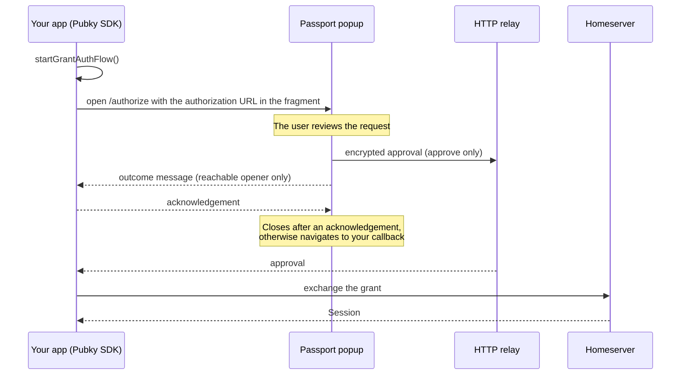

# Integrating with Pubky Passport

Pubky Passport approves authorization requests created by the Pubky SDK. Your app creates a
request, opens Passport, and waits for the SDK to receive the approval through the relay.

For SMS/Lightning onboarding with Ring signup inside Passport, see
[Create an account with SMS or Lightning](signup-integration.md).

> Authenticate the user only after the Pubky SDK returns a `Session`. Passport callbacks and
> messages describe the UI outcome; they are not credentials.

## Flow


```mermaid
sequenceDiagram
    participant App as Your app (Pubky SDK)
    participant Passport as Passport popup
    participant Relay as HTTP relay
    participant Homeserver

    App->>App: startGrantAuthFlow()
    App->>Passport: open /authorize with the authorization URL in the fragment
    Note over Passport: The user reviews the request
    Passport->>Relay: encrypted approval (approve only)
    Passport-->>App: outcome message (reachable opener only)
    App-->>Passport: acknowledgement
    Note over Passport: Closes after an acknowledgement,<br/>otherwise navigates to your callback
    Relay-->>App: approval
    App->>Homeserver: exchange the grant
    Homeserver-->>App: Session
```

1. Your app starts a grant auth flow and receives `flow.authorizationUrl`.
2. Your app opens Passport with that URL in the fragment of `/authorize`.
3. The user approves or cancels in Passport. On approval, Passport posts the encrypted approval to
   the relay before it reports the outcome to your app. It also republishes the identity's
   homeserver record in the background and keeps the page open up to two seconds after posting the
   approval, so the return to your app does not cut that republish off. The approval does not wait
   for it: an SDK already polling the relay may resolve the record before the republish lands.
4. The SDK receives the approval, exchanges it with the homeserver, and returns a `Session`.

The authorization URL contains the relay secret. Keep it in the browser, encode it exactly once,
and never log it or send it to analytics.

Passport opens a request in two steps. First it lists every identity saved in the browser, with
**Use another identity** and **Continue with Pubky Ring** below them. **Use another identity** opens
the start page (**Create account**, **Import recovery file**, Google where the instance offers it,
and Pubky Ring), keeping your request; **Back** returns to the list. Without saved identities the
request opens on that start page under the heading **Sign in to {app}**, with **Create account**
recommended and a **Continue with Pubky Ring** button below an "or"; that button appears only during
a request, never on the plain start page. Every step names your app the way permission review does:
with your callback host when your `x-source` label differs from it, or with a notice when the
request has no callbacks. The list reads no profiles: it shows the names and avatars kept from
earlier reads. Choosing an identity opens the permission review, with **Authorize**, **Cancel** and
**Switch** back to the list. Each identity shows where its key lives (**Key in Pubky Ring**, **Key
in this browser**, or its attached Google account), and one without a public profile is named after
its key. Identities held in Ring show one action, **Continue in Pubky Ring**, and say that the
identity is chosen in Ring. **Continue with Pubky Ring** hands your request to Ring unchanged: on a
phone or tablet (a coarse pointer) it follows the `pubkyauth://` link at once and shows the QR code
if the page is still in view about two seconds later, because Ring did not open; with a mouse or
trackpad (a fine pointer, such as your desktop popup) it shows the QR code directly, since a
computer cannot open the link. Passport cannot see Ring's approval, so **I approved in Pubky Ring**
reports `success` (see [Outcome messages](#outcome-messages)). Switching identities or creating an
account preserves the original request; a new account is asked for its public profile once, and
**Skip for now** there goes on to the review. A request for broad access (for example `/:rw`) is
flagged on the list, on the request's start page and on the Pubky Ring screen as well as on the
review, where its primary action names what it gives, such as **Allow changing all your data** or
**Allow reading all public data**, and the sentence above it says the same. Each permission shows a
plain title above its exact path, and tells your own folder (`/pub/<callback host>/`) from the
folders of other apps. A long list folds away only entries in your own public folder; broad entries,
the Pubky App's folders, private folders and other apps' folders always stay in view, and a request
without callbacks never folds. Local approval always requires an explicit **Authorize** (or **Allow
…**) action. When the answer cannot reach your app through a callback, Passport ends on an outcome
screen: an approval, a cancellation, an approval that did not reach the relay (the user starts again
in your app), or an identity whose key could not be unlocked in the browser. It names your app only
when the request has callbacks, beside their host; your `x-source` label alone never names it. A
request that expired before Passport loaded is told apart from a link that cannot be used. Each of
these offers **Close window** in your popup; in a tab of its own, the expired and invalid screens go
**Back to the app** when your page sent the user there, and the others offer a way to Passport's
start page. If the browser blocks Passport's storage during a request, Passport offers **Continue
with Pubky Ring** beside **Cancel**. Opening `/` without a request shows the selected identity
overview, or the add screen on first use. An unfinished local account setup resumes its saved key
and backup step after a reload.

While a request waits in a tab of its own (a same-tab redirect, or a popup whose opener has
closed), Passport asks the browser to confirm before the page is reloaded, closed or navigated
away, because leaving drops the request without an outcome message; the request itself is never
stored, so it does not survive a reload. A popup your page opened is never guarded: your page owns
it and may close it at any time without the user seeing a prompt, for example once Pubky Ring's
session arrives through the relay, at your attempt deadline or on your own cancel. While a request
is pending, the footer's legal links open in a new tab and the logo is not a link. If the browser
restores a page that was left mid-request from its back/forward cache, Passport says the request
has closed and offers **Close window** (or, without an opener, a way back to Passport) instead of
showing actions that could no longer answer your app.

Passport accepts only sign-in requests: `pubkyauth://signin_grant?…` from
`AuthFlowKind.signin()`, and the legacy `pubkyauth://signin?…` and `pubkyauth:///?…` forms.
Sign-up requests (`signup`, `signup_grant` from `AuthFlowKind.signup(…)`, and `direct_signup`) are
rejected as invalid; new users create their account inside Passport instead.

`/authorize#d=…` is the only entry that accepts a request. Passport forwards a request that
arrives at `/#d=…` to `/authorize` before any of its code runs, but that is a convenience, not a
contract; a query string is never forwarded, so `/?d=…` is still rejected. Navigating an open
Passport window to a new `/authorize#d=…` URL, for example by reusing a named popup, reloads
Passport with the new request and abandons any request still under review. `/authorize` without a
request, including a reload after the request was read, returns to `/`.

## Popup sign-in

Install the SDK:

```bash
pnpm add @synonymdev/pubky
```

Call `signInWithPassport()` directly from a click or tap handler, and run one attempt at a time,
for example by disabling the button while an attempt is pending. The popup opens before the first
`await`, otherwise the browser may block it.

```ts
import { AuthFlowKind, Pubky, type GrantAuthFlow, type Session } from "@synonymdev/pubky";

const PASSPORT_ORIGIN = "https://passport.pubky.app";
const CAPABILITIES = "/pub/example.app/:rw";
const CLIENT_ID = "example.app";
const CALLBACK_PATH = "/auth/passport/return";
export const CALLBACK_MESSAGE = "example.app.passport-return";
// The user may create an account inside the popup (verification, backup, profile setup), so the
// attempt deadline is long. Closing the popup still ends the attempt at once.
const ATTEMPT_TIMEOUT_MS = 30 * 60_000;
// After a `success` message Passport has posted the approval to the relay, or, after a Pubky Ring
// handoff, the user reports approving in Ring. Either way the wait is short, and only the SDK
// `Session` authenticates.
const RELAY_GRACE_MS = 60_000;
const POLL_INTERVAL_MS = 250;

const pubky = new Pubky();

type Outcome = "success" | "error" | "cancel";

export async function signInWithPassport(): Promise<Session> {
  const popup = window.open(
    "about:blank",
    `pubky-passport-${crypto.randomUUID()}`,
    "popup,width=520,height=760",
  );
  if (!popup) throw new Error("Passport popup was blocked");

  let outcome: Outcome | undefined;
  let succeededAt: number | undefined;
  const onMessage = (event: MessageEvent<unknown>) => {
    const received = readOutcome(event, popup);
    if (!received) return;
    outcome = received;
    if (received === "success") succeededAt ??= Date.now();
  };
  window.addEventListener("message", onMessage);

  try {
    const flow = await pubky.startGrantAuthFlow(CAPABILITIES, AuthFlowKind.signin(), {
      clientId: CLIENT_ID,
      xCallback: {
        xSource: "Example App",
        xSuccess: callbackUrl("success"),
        xError: callbackUrl("error"),
        xCancel: callbackUrl("cancel"),
      },
    });
    popup.location.replace(
      `${PASSPORT_ORIGIN}/authorize#d=${encodeURIComponent(flow.authorizationUrl)}`,
    );

    return await waitForSession(flow, () => {
      if (outcome === "cancel") return "Passport authorization was cancelled";
      if (outcome === "error") return "Passport could not approve the request";
      // After a `success` message Passport closes the popup itself; keep polling for the relay,
      // but only briefly, however long the user spent in the popup before approving.
      if (succeededAt !== undefined && Date.now() - succeededAt > RELAY_GRACE_MS) {
        return "Passport approval did not arrive through the relay";
      }
      if (popup.closed && outcome !== "success") return "Passport popup was closed";
      return undefined;
    });
  } finally {
    window.removeEventListener("message", onMessage);
    closePopup(popup);
  }
}

/**
 * Polls until a session arrives, the deadline passes, or `interruption()` returns a reason.
 * `awaitApproval()` cannot be interrupted, so popup attempts poll with `tryPollOnce()` instead.
 */
async function waitForSession(
  flow: GrantAuthFlow,
  interruption: () => string | undefined,
): Promise<Session> {
  try {
    const deadline = Date.now() + ATTEMPT_TIMEOUT_MS;
    while (Date.now() < deadline) {
      const reason = interruption();
      if (reason) throw new Error(reason);

      const session = await flow.tryPollOnce();
      if (session) return session;
      await new Promise((resolve) => setTimeout(resolve, POLL_INTERVAL_MS));
    }
    throw new Error("Passport authorization timed out");
  } finally {
    flow.free(); // No call is in flight here.
  }
}

/** Returns the outcome carried by a message from this attempt's popup; acknowledges Passport's. */
function readOutcome(event: MessageEvent<unknown>, popup: Window): Outcome | undefined {
  const data = event.data;
  if (event.source !== popup || !isRecord(data) || !isOutcome(data.outcome)) return undefined;

  if (event.origin === PASSPORT_ORIGIN) {
    if (
      data.type !== "pubky-passport.authorization-outcome" ||
      data.version !== 1 ||
      typeof data.messageId !== "string"
    ) {
      return undefined;
    }
    // Acknowledge so Passport closes the popup instead of navigating it to the callback.
    popup.postMessage(
      { type: "pubky-passport.authorization-outcome-ack", version: 1, messageId: data.messageId },
      PASSPORT_ORIGIN,
    );
    return data.outcome;
  }

  // Sent by the callback page when Passport fell back to navigation.
  if (event.origin === window.location.origin && data.type === CALLBACK_MESSAGE) {
    return data.outcome;
  }
  return undefined;
}

function callbackUrl(outcome: Outcome): string {
  const url = new URL(CALLBACK_PATH, window.location.origin);
  url.searchParams.set("outcome", outcome);
  return url.href;
}

function closePopup(popup: Window): void {
  try {
    if (!popup.closed) popup.close();
  } catch {
    // Closing a cross-origin popup is best effort.
  }
}

export function isOutcome(value: unknown): value is Outcome {
  return value === "success" || value === "error" || value === "cancel";
}

function isRecord(value: unknown): value is Record<string, unknown> {
  return typeof value === "object" && value !== null && !Array.isArray(value);
}
```

Replace `CAPABILITIES` and `CLIENT_ID` with values belonging to your app, and request only the
access you need. Save the returned session with `pubky.browserSessionStore.save(session)` if it
must survive a page reload.

### Ending an attempt

`flow.awaitApproval()` blocks until the relay delivers an approval. It cannot be interrupted, and a
flow must not be freed while one of its calls is pending, so a popup attempt polls with
`flow.tryPollOnce()` instead and decides between polls:

| Signal                               | Meaning                                                         | What the example does                     |
| ------------------------------------ | --------------------------------------------------------------- | ----------------------------------------- |
| SDK returns a `Session`              | The user is authenticated                                       | Returns it and closes the popup           |
| `success` message                    | Approval posted, or reported after a Ring handoff; popup closed | Keeps polling until the `Session` arrives |
| No `Session` a minute after success  | No approval reached the relay                                   | Ends the attempt                          |
| `error` or `cancel` message          | Passport could not approve, or the user declined                | Ends the attempt                          |
| Popup closed without an outcome      | The user abandoned the attempt                                  | Ends the attempt                          |
| SDK throws                           | Relay, network, or approval failure                             | Ends the attempt                          |
| Attempt deadline passed (30 minutes) | The user never finished                                         | Ends the attempt                          |

The popup's lifetime and the relay wait are separate. A new user may verify a phone number or pay
an invoice, save and check a backup, and publish a profile before approving, all inside the popup,
so the attempt deadline must leave room for that; a five-minute deadline would close the popup in
the middle of account creation. Once Passport reports `success`, it has posted the approval to the
relay, or, after a Pubky Ring handoff, the user reports approving in Ring; either way the approval
should arrive with the next polls, so that wait gets its own short limit (`RELAY_GRACE_MS`). Only
the SDK `Session` authenticates the user. Closing the popup ends the attempt immediately, so a long
deadline never keeps an abandoned attempt alive.

Every ending frees the flow, removes the message listener, and closes the popup if it is still
open. Never reuse a flow after its attempt ended; start a fresh one to retry.

## Callback page

Passport navigates the popup to your callback when it cannot deliver the outcome message: the
popup has no opener, the callback origin differs from your page's origin, or your page did not
acknowledge within three seconds. The callback page forwards the outcome to the opener and closes
the popup, reusing `CALLBACK_MESSAGE` and `isOutcome()` from the module above:

```ts
// Served at CALLBACK_PATH. The query string is an untrusted hint; it never signs the user in.
const outcome = new URLSearchParams(window.location.search).get("outcome");
const opener: Window | null = window.opener;

if (isOutcome(outcome) && opener && !opener.closed) {
  opener.postMessage({ type: CALLBACK_MESSAGE, outcome }, window.location.origin);
  window.close();
}
```

Always render a visible link back to your app, because the page may open without an opener. If
the page needs authenticated state, resume the SDK flow and wait for a `Session`.

Callbacks are optional. When present, they must be HTTPS and share one origin, otherwise Passport
rejects the whole request; omit them while developing over plain HTTP. Without callbacks, Passport
shows its own result screen in the popup, and your app learns about a cancellation only when the
popup is closed or the deadline passes.

## Outcome messages

When the popup's opener is reachable and your callbacks share its origin, Passport first posts:

```ts
type PassportOutcomeMessage = {
  type: "pubky-passport.authorization-outcome";
  version: 1;
  outcome: "success" | "error" | "cancel";
  messageId: string;
};
```

Verify `event.origin` against the exact Passport origin, confirm `event.source` is the popup of
the current attempt, and validate every field. Then acknowledge with the same `messageId`:

```ts
type PassportOutcomeAcknowledgement = {
  type: "pubky-passport.authorization-outcome-ack";
  version: 1;
  messageId: string;
};
```

Use the exact Passport origin as `targetOrigin`, never `"*"`. Passport waits up to three seconds
for the acknowledgement. Once acknowledged, it closes the popup; without an acknowledgement, it
navigates the popup to the matching callback.

A `success` message means Passport posted the approval to the relay; keep waiting for the SDK.
After a Pubky Ring handoff, `success` means only that the user pressed **I approved in Pubky Ring**:
Passport cannot see Ring's approval, which may still be on its way or missing, so the short relay
wait after `success` matters there. Without callbacks Passport reports nothing and tells the user to
return to your app. `error` and `cancel` end the attempt. None of these messages authenticate the user.

## Browser requirements

- Build the Passport URL as `/authorize#d=${encodeURIComponent(flow.authorizationUrl)}`.
  Passport rejects requests that carry a query string.
- Set `xSource` to a short display name of at most 128 characters. Passport shows the callback
  host separately because `xSource` is not a verified identity.
- Open the popup without `noopener` or `noreferrer`, otherwise Passport cannot message your page.
- `Cross-Origin-Opener-Policy: same-origin` on your page severs the popup: `window.opener` becomes
  `null` in Passport and your `popup` reference reports `closed`. Use `same-origin-allow-popups`
  if you need COOP.
- Allow the HTTP relay, the pkarr relays, and the homeservers the SDK contacts in your CSP
  `connect-src`.
- Do not embed Passport in an iframe; it sends `frame-ancestors 'none'`.

## Same-tab navigation

Passport also works without a popup. Before navigating the current page to Passport, save the
pending flow with `flow.saveLocal()` in `sessionStorage`. Passport returns by navigating to your
callback because there is no opener. On the callback page, resume with
`pubky.resumeGrantAuthFlow(savedState)` when the outcome hint is `success`, wait for the
`Session` with the same polling loop, and delete the saved state as soon as the flow completes or
is abandoned. Never use `localStorage`: the saved state contains the relay secret and
Proof-of-Possession key material.

## Integration checklist

Test at least these cases before shipping:

- Approval returns a `Session`, and the popup closes.
- A `success` message alone does not sign the user in.
- `error` and `cancel` end the attempt without a session.
- Closing the popup ends the attempt.
- A blocked popup fails immediately with a clear message.
- Without an acknowledgement, the callback page closes the popup and the attempt ends.
- Messages from other origins or windows are ignored.
- Creating a new account inside the popup finishes well within the attempt deadline.
- The deadline ends the attempt and frees the flow.
- A second click during a pending attempt does not start a second one.

## Profile setup in Passport

Clients can expose one **Sign in** button and optionally their SDK flow's Ring QR code.
Passport handles identity choice, account creation, backup verification, and public profile
setup. New accounts finish profile publication before returning to permission review. Existing
identities load their public profile when available.

Ring profile editing uses Passport's own limited delegated grant, write-only for the profile document
and avatar files. It never modifies the client's request or treats opening Ring as a successful
sign-in. Your request comes first: for a Ring identity whose profile setup is unfinished, Passport
opens permission review and asks for its own profile grant only once no request is under review.
The `/authorize#d=…` entry and outcome protocol above are unchanged; continue waiting for your
original SDK flow to return a session.
