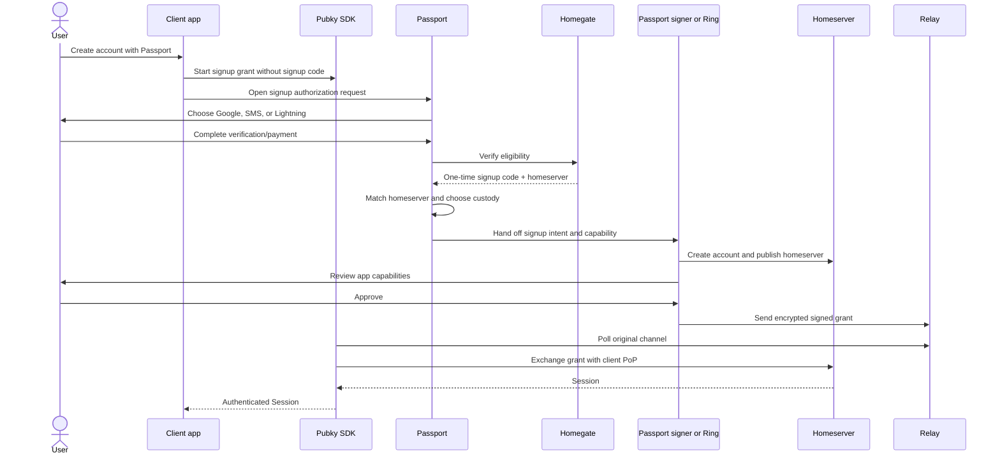

# Discussion RFC: Passport as the Pubky onboarding front door

> **Status:** discussion only; this document and its pull request are intentionally not ready to
> merge.
>
> **Research snapshot:** 2026-09-03. Repository observations are pinned to the commits listed in
> [Sources](#sources).

## Summary

Passport should become the default place where Pubky users choose an identity, create an account,
and approve an app. Pubky clients should have one primary action—**Continue with Passport**—rather
than implementing Google, SMS, Lightning, browser-key, and Pubky Ring flows independently.

The recommended boundary is:

- The **client app** creates a standard Pubky grant flow and keeps the relay secret and client
  Proof-of-Possession key. It opens Passport and accepts only the `Session` returned by the Pubky
  SDK as proof of success.
- **Passport** validates the request, presents onboarding and identity choices, obtains a
  Homegate signup code when an account must be created, and routes the request to the selected
  signer.
- **Pubky Ring** remains the signer and consent surface whenever it holds the identity. Its root
  key never enters the client app or Passport during authorization.
- **Homegate** remains the verification and signup-eligibility service. Google, SMS, and Lightning
  are ways to obtain a one-time signup capability, not interchangeable account-recovery factors.
- A small, headless **`@pubky/passport` package** should remove popup/redirect lifecycle mistakes,
  but the Pubky SDK remains the source of cryptographic flows and sessions.

Under this model, Passport displays the Pubky Ring QR code (or opens Ring on the same device). Ring
displays the final capability review and approval. Direct app-to-Ring integration remains supported
for compatibility and specialized clients.

A local-only Passport identity is useful as a privacy-preserving and provider-independent escape
hatch, but the current plaintext `localStorage` representation should not be presented as durable
secure custody. Local-only creation should ship only with an explicit browser-signer threat model,
encrypted-at-rest storage, and a completed recovery step. The existing Pubky recovery file should
be the default portable backup. Twelve-word phrase import should be supported for compatibility;
new phrase generation should wait until the Pubky derivation and interchange format are specified
and tested across Passport, pubky.app, and Ring.

## Decision requested

This RFC asks the team to agree on five directional decisions before implementation:

1. Passport is the default onboarding and authorization front door for Pubky clients.
2. Passport owns the Ring handoff UI; Ring owns final consent when it owns the key.
3. Apps integrate through a thin package over the existing Pubky SDK grant flow.
4. SMS and Lightning UI move from pubky.app to Passport and converge on the same Homegate
   invitation contract already used by Google.
5. Local-only identity is an optional, non-default custody profile, gated on storage and recovery
   hardening.

## Goals

- Give web clients one safe, short integration path for returning-user sign-in and first-user
  onboarding.
- Keep existing Pubky Ring security properties and direct integrations working.
- Move provider-specific onboarding policy out of individual clients.
- Make custody a deliberate choice, independent from how signup eligibility was obtained.
- Keep secret keys inside the selected signer and keep signup codes out of client apps.
- Support desktop, mobile web, and native clients without making a popup the protocol.
- Provide enough high-level UX definition for product and engineering discussion.

## Non-goals

- Replacing the Pubky auth protocol or Pubky SDK.
- Turning Passport outcome messages or redirect parameters into credentials.
- Making SMS or Lightning a way to recover an existing identity.
- Silently migrating a Ring identity into browser storage.
- Requiring every client to remove its direct Ring path immediately.
- Selecting final visual design or provider pricing.
- Claiming that browser custody can have the same threat model as OS-backed Ring custody.

## Terms and trust boundaries

| Term        | Responsibility                                                           | Must not be confused with                           |
| ----------- | ------------------------------------------------------------------------ | --------------------------------------------------- |
| Client app  | Starts the SDK flow, requests minimum capabilities, receives the session | A signer or identity-recovery service               |
| Passport    | Onboarding coordinator and browser signer for identities it holds        | The authority that authenticates the client session |
| Pubky Ring  | Mobile signer and root-key custodian                                     | A QR viewer controlled by Passport                  |
| Homegate    | Verifies eligibility and returns a homeserver signup capability          | A custodian for the user's root key                 |
| Signup code | Short-lived, one-use bearer capability for account creation              | An identity, session, or durable recovery factor    |
| Pubky grant | User-signed capabilities bound to the client's PoP public key            | A Passport callback message                         |
| Session     | SDK result used by the client for authenticated homeserver access        | A UI success signal                                 |

The most important invariant is already documented in Passport's
[integration guide](integration.md): only the SDK-returned `Session` authenticates a user. Passport
messages and callbacks only coordinate UI.

## What exists today

### Passport

- The `/authorize` entry accepts encoded `pubkyauth` requests in the fragment, reviews capabilities,
  approves with a locally held key, and hands a UI outcome back to the caller.
- The parser currently accepts cookie and grant **sign-in** intents only. It rejects signup intents
  and does not accept `hs` or `st` parameters.
- First-use onboarding currently offers Google only.
- The Google path reads or creates an encrypted Passport file in Google Drive, requests a separate
  Homegate signup invitation for a new account, signs up, publishes, and saves a local working copy.
- The local identity catalog stores each 32-byte root secret as base64url in `localStorage`. Recovery
  file download and explicit migration to Ring already exist.
- Ring migration currently exports the root secret through a `pubkyring://` handoff or QR. That is
  an identity-transfer operation and should stay separate from ordinary authorization.

### pubky.app

- SMS and Lightning verification happen inside pubky.app. Both produce a Homegate signup code and
  homeserver public key.
- Verification happens before custody selection. The user then either creates keys in the browser
  or continues with Ring.
- Browser creation generates a twelve-word BIP-39 mnemonic and deterministically takes the first
  32 bytes of the BIP-39 seed as the Pubky secret.
- The Ring signup screen displays a signup authorization QR on desktop and opens Ring through a
  custom scheme on mobile.
- Sign-in supports Ring, encrypted recovery-file upload, and twelve-word phrase entry.

### Homegate and Pubky SDK

- Homegate has separate Google, SMS, and Lightning endpoints that converge on a signup code and
  homeserver public key.
- The Pubky SDK already models `AuthFlowKind::SignUp` and `signup_grant`, including a homeserver and
  optional signup token. This should be extended or composed rather than introducing a Passport-only
  cryptographic protocol.
- Grant approval is bound to a client PoP public key. This materially limits what an observer of an
  authorization QR can do with the signed grant, even though authorization URLs remain sensitive.

## Product model: verification, custody, and app authorization are separate

The current user journey can look like one operation, but it contains three distinct decisions:

```text
Can this person create an account?  ->  Where is the root key held?  ->  What may this app do?
Homegate verification                  Passport or Ring                 Pubky grant capabilities
```

Keeping those stages separate prevents several dangerous shortcuts:

- A phone number cannot become a de facto recovery key. Phone numbers are recycled and SMS is not
  phishing resistant.
- A Lightning invoice cannot become an account identifier. It proves payment, not stable identity.
- A Google Homegate check does not itself recover an identity. Passport's existing Google recovery
  works because a separate wrapping-key and Drive-file design reconstructs the same root key.
- Choosing Ring does not require exporting Ring's root key to Passport. Ring signs the app's request
  directly.

Provider adapters in Passport should all return one normalized result:

```ts
type HomeserverSignupInvitation = {
  signupCode: string;
  homeserverPubky: string;
};
```

The result is sensitive, memory-only, short lived, and consumed exactly once. Passport must verify
that `homeserverPubky` is the homeserver requested by the client before using the code.

## Recommended client protocol

### One public entry point

The client always starts the flow because only the client should retain the relay secret and PoP
private key needed to receive and use the result.

For sign-in, the client creates:

```ts
pubky.startGrantAuthFlow(capabilities, AuthFlowKind.signin(), options);
```

For onboarding, it creates a signup flow for the intended homeserver without possessing a signup
code yet:

```ts
pubky.startGrantAuthFlow(
  capabilities,
  AuthFlowKind.signup(homeserverPublicKey, undefined),
  options,
);
```

It then opens:

```text
https://passport.pubky.app/authorize#d=<encoded pubkyauth URL>
```

The fragment is intentional: sensitive flow material should not be sent in the Passport HTTP
request, server logs, or referrer. The app keeps polling the SDK flow. A Passport or callback
`success` means only “approval was submitted; continue waiting.”

### Passport request handling

Passport should add strict support for `signup` and `signup_grant` while retaining the current
validated-request wrapper:

1. Parse and bound the request before rendering anything.
2. Preserve the original relay secret, client ID, client PoP key, capabilities, and callbacks.
3. Show the callback host separately from the unverified `x-source` display name.
4. Require a configured/allowed homeserver for first-party provider-funded signup.
5. Reject any Homegate response whose homeserver does not exactly match the request.
6. Never put the raw authorization URL, signup code, phone number, Google token, or root key in
   React state, logs, analytics, URLs, or error reporting.

### Who displays Ring QR?

| Option                                                   | Benefits                                                                                                  | Costs and risks                                                                                       | Assessment                 |
| -------------------------------------------------------- | --------------------------------------------------------------------------------------------------------- | ----------------------------------------------------------------------------------------------------- | -------------------------- |
| Every client displays Ring QR                            | Shortest Ring-only path; already works                                                                    | Every app duplicates QR, mobile handoff, expiry, callback, and onboarding logic; Passport is bypassed | Keep as compatibility path |
| Passport displays Ring QR                                | One client integration; consistent account selection and consent routing; provider codes stay out of apps | One extra browser surface; Passport and app must coordinate completion                                | **Recommended default**    |
| OS dispatches a Pubky URL directly to a preferred signer | Elegant long-term protocol handler                                                                        | Platform association, chooser behavior, and web fallback require more design                          | Explore later              |

Passport should display the **original canonical auth request** for returning-user Ring sign-in. For
signup, Passport must provide Ring the same request plus the Homegate-issued signup capability. The
preferred implementation is an SDK-owned typed transformation or an opaque, one-time Homegate
redemption handle; Passport should not perform ad-hoc string rewriting of security-sensitive URLs.

Ring must parse the request independently and show the final app identity, homeserver action, and
capabilities. Passport may show a preview before handoff, but a preview is not consent. The component
holding the key owns final consent.

### Desktop returning-user Ring flow

```mermaid
sequenceDiagram
    actor User
    participant App as Client app
    participant SDK as Pubky SDK
    participant Passport
    participant Ring as Pubky Ring
    participant Relay
    participant HS as Homeserver

    User->>App: Continue with Passport
    App->>SDK: Start grant sign-in flow
    App->>Passport: Open /authorize#d=...
    Passport->>User: Choose saved identity or Pubky Ring
    User->>Passport: Choose Pubky Ring
    Passport->>User: Show QR containing canonical request
    User->>Ring: Scan QR
    Ring->>User: Choose Ring identity; review app and capabilities
    User->>Ring: Approve
    Ring->>Relay: Send encrypted signed grant
    SDK->>Relay: Poll original channel
    SDK->>HS: Exchange grant with client PoP
    HS-->>SDK: Session
    SDK-->>App: Authenticated Session
    App->>Passport: Acknowledge/close UI when possible
```

High-level UX:

```text
App: Continue with Passport
  -> Passport: Choose identity
  -> Passport: Use Pubky Ring
  -> Passport: Scan with Ring
  -> Ring: Choose identity + review app permissions
  -> Ring: Approved
  -> App: Signed in
```

### Mobile returning-user Ring flow

```text
Client app or web app
  -> opens Passport in the system browser/authentication tab
  -> Passport offers "Open Pubky Ring"
  -> Ring shows the final review and signs
  -> Ring returns to the client's verified callback
  -> client SDK receives the session through the relay
```

Use claimed HTTPS links—Apple Universal Links and Android App Links—where possible. They prove
domain association to the operating system and are preferred over interceptable custom schemes for
authorization returns. A custom scheme can remain a fallback, but it must never carry a root key in
ordinary sign-in. RFC 8252 provides the closest mature model: native authorization uses an external
user agent, claimed HTTPS redirects are preferred where available, and clients correlate the return
to the request.

The callback remains a UI return channel. A malicious or stale callback cannot sign the user in;
the SDK session is still required.

### New-user flow



High-level UX:

```text
App: Create account with Passport
  -> Passport: Verify with Google / SMS / Lightning
  -> Passport: Keep keys in Ring (recommended) / this browser
  -> Selected signer: Create account
  -> Selected signer: Review app permissions
  -> App: Account ready
```

There is a timing trade-off in verifying before custody selection: a Ring installation can outlive a
short signup-code TTL. Near term, Passport can preserve pubky.app's existing order but offer Ring
installation before starting a paid or rate-limited verification and allow a clean re-verification.
Longer term, pairing with Ring first would let Homegate issue a capability bound to a Ring-generated
public key, if homeserver signup codes gain that feature.

### Passport-held signer flow

For an existing Passport identity:

```text
Passport identity selected
  -> Passport shows app origin + requested capabilities
  -> user approves
  -> Passport signs and posts to the original relay
  -> client SDK exchanges the grant and returns a session
```

For a new Passport-held identity, the root key is created before account signup, the selected backup
policy is completed, and then Passport uses the Homegate code to create the account. Authorization
approval follows only after signup and homeserver publication succeed.

## Pubky Ring security non-regression contract

“As secure as Ring is today” needs to be an explicit release contract, not an assumption. Adding
Passport must preserve these properties:

1. Ring root keys remain inside Ring for sign-in and signup.
2. Ring independently parses the request; Passport's display is not trusted input to Ring.
3. Ring displays final, human-readable consent before signing.
4. The signed grant is bound to the requesting client's PoP key.
5. Ring sends approval to the request's relay; Passport does not proxy the credential.
6. Direct app-to-Ring QR and deep-link flows continue to work during and after migration.
7. Passport is opened in a system browser/authentication tab for native clients, not a credential-
   observing web view.
8. A Ring auth handoff never contains the Ring root key or recovery phrase.
9. New handoff formats are versioned, bounded, short lived, replay tested, and threat modeled by the
   Passport, Ring, SDK, Homegate, and homeserver owners.

The existing **migrate identity to Ring** flow is intentionally different: it exports root material.
It must remain an explicit, strongly warned, user-initiated operation and must never be reused as an
authorization shortcut. A future migration protocol should prefer an authenticated/encrypted
device-to-device channel over placing a raw root secret in a broadly claimable custom URI scheme.

## Should Passport support a local-only identity?

Yes, as an optional portability and privacy profile. No, if “local-only” means silently persisting a
plaintext root key and presenting it as comparable to Ring.

### Options

| Option                                | Recovery                                | Security/UX profile                                                                                                       | Recommendation                                   |
| ------------------------------------- | --------------------------------------- | ------------------------------------------------------------------------------------------------------------------------- | ------------------------------------------------ |
| No local-only identity                | Google-backed Passport or Ring only     | Smallest browser attack surface; excludes users who want neither                                                          | Keep as fallback if hardening is not funded      |
| Current plaintext browser store       | Recovery file or Ring export            | Fast, but an origin XSS or malicious same-origin dependency can read every stored root key; browser clearing loses access | Do not market or expand as durable local custody |
| Encrypted browser vault               | Recovery file; optional phrase import   | Better protection while locked; still vulnerable while unlocked and to compromised UI; adds unlock UX                     | **Preferred persistent local design**            |
| Session-only recovery-file signer     | Encrypted file + passphrase on each use | No persistent root key in the browser; high friction; good provider-independent fallback                                  | Ship alongside the vault                         |
| Generate and immediately move to Ring | Ring becomes custodian                  | Strong default custody but not truly local-only                                                                           | Keep as prominent recommendation                 |

OWASP advises against storing sensitive information in `localStorage` because a single XSS can read
it. Encrypting a vault improves protection against disk/browser-profile disclosure and opportunistic
storage reads, but it does not make an unlocked browser signer safe from same-origin compromise.

### Recommended local-only UX

Creation:

```text
Choose "This browser"
  -> create Pubky root key locally
  -> choose unlock method
  -> download encrypted recovery file
  -> re-enter passphrase or confirm file was saved
  -> create homeserver account
  -> approve requesting app
```

Returning use:

```text
Choose local identity
  -> unlock encrypted vault
  -> review app + capabilities
  -> sign
  -> clear in-memory key material after use/idle timeout
```

Portable use:

```text
Choose "Use a recovery file"
  -> select .pkarr file (read locally)
  -> enter passphrase
  -> derive identity and resolve homeserver
  -> review and sign for this session
  -> do not persist root key unless user explicitly chooses to
```

The recovery step should happen before a new local account is considered complete. The UI must say
plainly that losing both browser storage and the backup loses the identity permanently.

### Recovery file versus twelve-word phrase

| Property         | Encrypted Pubky recovery file                                 | Twelve-word phrase                                                   |
| ---------------- | ------------------------------------------------------------- | -------------------------------------------------------------------- |
| At-rest secrecy  | Encrypted with a user passphrase                              | Plaintext bearer secret when written or displayed                    |
| Portability      | Requires a file plus passphrase                               | Easy to write or type; hard to enter correctly                       |
| Existing support | Pubky SDK, Passport export, pubky.app import                  | pubky.app generation/import and Ring-oriented export                 |
| Main failure     | File or passphrase loss; offline guessing of weak passphrases | Screenshots, phishing, clipboard/cloud exposure, transcription loss  |
| Format risk      | Current SDK format needs explicit version/KDF review          | “BIP-39” alone does not define Pubky's 32-byte derivation convention |

Recommendation:

- Make the SDK recovery file the default backup and session-only import path.
- Require a genuinely strong passphrase; the current six-character minimum is not a meaningful
  security target for offline attack resistance.
- Version a future recovery-file format with an explicit KDF, parameters, random salt, cipher,
  associated data, and test vectors. Keep importing the existing format.
- Import the existing pubky.app twelve-word format for account compatibility.
- Do not generate a new phrase in Passport until the exact normalization, wordlist, PBKDF2 input,
  32-byte extraction/derivation, optional passphrase behavior, and cross-product test vectors are a
  Pubky specification.
- Never send an uploaded file, passphrase, mnemonic, or derived secret to Passport servers,
  Homegate, analytics, or crash reporting.

BIP-39 defines how 128 bits of entropy plus a four-bit checksum become twelve words and how the
mnemonic becomes a 512-bit seed. It does not say that “the first 32 bytes are a Pubky root key”; that
is a Pubky-specific compatibility rule currently implemented by pubky.app and must be specified as
such.

### Unlock mechanisms

An encrypted browser vault needs a separate decision:

- **User passphrase:** universally available and understandable; vulnerable to offline guessing if
  the encrypted vault is stolen. Use a memory-hard, per-vault salted KDF and strength guidance.
- **WebAuthn PRF/passkey-assisted wrapping:** can improve same-device unlock and phishing resistance
  on supported authenticators, but support and backup/sync behavior vary. Treat as progressive
  enhancement, not the only recovery path.
- **Origin-held wrapping key:** convenient but provides little protection from a compromised origin
  and can be lost with browser storage. It is not sufficient by itself.

No unlock mechanism removes the need for a portable recovery path.

## Package or documentation only?

### Options

| Option                          | Advantages                                                               | Drawbacks                                                                                                                          | Assessment                                          |
| ------------------------------- | ------------------------------------------------------------------------ | ---------------------------------------------------------------------------------------------------------------------------------- | --------------------------------------------------- |
| Documentation only              | No new package; maximum flexibility                                      | The existing guide already demonstrates substantial popup, callback, polling, timeout, and cleanup logic that every app would copy | Insufficient as the preferred path                  |
| Full Passport UI widget         | Fast visual integration                                                  | Framework/version coupling; duplicated UI and protocol policy; iframe temptation                                                   | Do not recommend                                    |
| Headless Passport flow helper   | Small API; consistent safety behavior; apps own their button and session | Must track Pubky SDK versions and browser edge cases                                                                               | **Recommended for web**                             |
| SDK absorbs Passport navigation | One package for developers                                               | Couples a general Pubky protocol SDK to one hosted Passport deployment/brand                                                       | Consider only after adoption proves the abstraction |

### Proposed package boundary

The package name is provisional: `@pubky/passport`.

It should:

- start from, or create through an injected SDK instance, a grant flow;
- synchronously open a blank popup from the user's click before async work;
- construct the Passport fragment URL exactly once;
- validate Passport origin, popup source, message version, attempt ID, and acknowledgements;
- keep polling the SDK regardless of optimistic UI callbacks;
- support abort, timeout, popup closure, callback fallback, and concurrent-attempt isolation;
- support redirect/resume mode with sensitive pending state in `sessionStorage`;
- optionally persist the resulting session only through the SDK's session store;
- expose typed progress and errors without exposing the authorization URL;
- include a test harness or conformance fixtures for integrators.

It should not:

- implement cryptography, parse or rewrite Pubky auth URLs independently of the SDK;
- render provider, Ring QR, capability-consent, or recovery UI;
- accept Passport `success` as authentication;
- log authorization URLs or pending flow state;
- force an iframe or embedded web view;
- hide requested capabilities from the integrating app.

Illustrative shape, not a settled API:

```ts
const session = await authorizeWithPassport({
  pubky,
  passportOrigin: "https://passport.pubky.app",
  capabilities: "/pub/example.app/:rw",
  kind: AuthFlowKind.signin(),
  clientId: "example.app",
  mode: "popup", // or "redirect"
  signal,
});
```

Native Swift/Kotlin applications should follow the same protocol but use platform browser sessions
and claimed HTTPS return links. An npm package is not a native integration strategy; small native
helpers can follow once the web contract is stable.

## Client identity and phishing UX

`x-source` is a self-asserted label. Passport correctly shows the HTTPS callback host separately;
that host is the strongest current user-visible signal. Options for stronger client identity are:

1. Keep the current label + exact callback host and use copy guidelines that do not imply the label
   is verified.
2. Require `clientId` to be a domain controlled by the web client and require callback origins to
   match an allowed relationship.
3. Add a `/.well-known/` metadata document with app name, icon, redirect origins, and native app
   associations.
4. Add a curated registry for first-party clients.

Recommendation: use option 1 for the first migration, define the constraints for option 2 before
third-party promotion, and explore option 3. A central registry can improve display quality but
should not become a requirement for open ecosystem clients.

Passport and Ring must use consistent language:

- “**example.app** requests…” for a verified/matched domain.
- “**Name provided by the app**” for `x-source` if it cannot be verified.
- Highlight broad capabilities such as `/`, `/pub/`, or `/priv/`.
- Ring repeats the final review when Ring signs; it does not trust Passport's prior rendering.

## Provider migration from pubky.app

Move provider UX and orchestration, not Homegate's server responsibilities:

1. Add provider-neutral invitation and availability interfaces in Passport.
2. Keep the current Google adapter and add SMS and Lightning adapters with a shared error model.
3. Port regional availability, rate-limit, retry, invoice-expiry, background/foreground, and abort
   behavior from pubky.app.
4. Make all provider flows converge before custody selection.
5. Keep phone numbers and invoices out of client apps and Passport telemetry.
6. Add idempotency and exact homeserver matching at the Homegate boundary.
7. Have pubky.app consume the Passport package while its existing flow remains available behind a
   rollback switch.
8. Remove client-owned provider screens only after production parity and an agreed support window.

Provider-specific UX:

```text
Google: choose account -> grant minimum Google access -> create/restore Passport identity
SMS: enter E.164 phone -> receive code -> enter six digits -> receive signup capability
Lightning: create invoice -> show QR/copy invoice -> await payment -> receive signup capability
```

Google is special because it can also back up and restore the Passport root key. The UI should make
that additional role clear. SMS and Lightning stop at signup eligibility unless a separate recovery
design is approved.

## Security analysis

| Threat                                      | Required response                                                                                                                              |
| ------------------------------------------- | ---------------------------------------------------------------------------------------------------------------------------------------------- |
| Malicious client imitates Passport or Ring  | External, origin-visible Passport surface; Ring parses independently; never enter recovery material in a client UI                             |
| Forged Passport callback                    | Treat callbacks as UI signals; authenticate only with SDK session; exact origin/source/attempt checks                                          |
| Authorization URL leaks                     | Fragment transport, redacted logs, `sessionStorage` only for pending resume, short relay TTL, PoP-bound grants                                 |
| QR shoulder surfing                         | Short lifetime; Ring displays request; PoP prevents session use without client key; recognize that identity/capability metadata can still leak |
| Signup code stolen from Ring signup QR      | Short-lived one-use code, minimal display lifetime, no logs; prefer key/flow binding or opaque redemption in a future protocol                 |
| XSS on Passport                             | Strict CSP and dependency policy; no third-party scripts; encrypted locked vault; keep root key in memory only while needed                    |
| Browser profile/storage copied              | Encrypted vault with memory-hard KDF; recovery file stored separately                                                                          |
| Weak recovery-file passphrase               | Strength requirements, memory-hard salted KDF, format versioning; rate limiting cannot stop offline guesses                                    |
| Phone number recycled or SIM swapped        | SMS is signup eligibility only, never existing-account recovery                                                                                |
| Paid verification succeeds but flow is lost | Idempotent status lookup and bounded resume; never double charge on refresh                                                                    |
| Provider returns wrong homeserver           | Exact comparison with requested homeserver; abort on mismatch                                                                                  |
| Custom URI scheme hijacked                  | Prefer claimed HTTPS app links; never carry root material in ordinary auth; keep custom fallback narrowly scoped                               |
| Double approval or replay                   | One active attempt, one-use relay/signup capabilities, state-machine tests, idempotent terminal handling                                       |

OAuth standards do not govern Pubky, but they offer useful, battle-tested transport guidance. RFC
8252 recommends external user agents for native authorization and claimed HTTPS redirects where
available. RFC 9700 emphasizes exact redirect validation, avoiding credentials in insecure channels,
and sender-constraining credentials where possible. Pubky's grant + client PoP design aligns with the
last principle; the Passport design should preserve it.

## Rollout plan

### Phase 0: agree on contracts

- Decide this RFC's five directional questions.
- Write a cross-repository threat model and non-regression test plan with Ring owners.
- Specify signup-without-code entry and the typed, safe way Passport supplies the eventual signup
  capability to Passport's signer or Ring.
- Specify client identity display rules and callback/domain constraints.
- Specify the existing mnemonic derivation as a legacy compatibility profile if phrase import is
  retained.

### Phase 1: client integration foundation

- Publish a versioned headless web package and a minimal reference app.
- Add contract tests for popup, redirect/resume, callbacks, timeouts, concurrent attempts, and
  “UI success but no relay result.”
- Keep the current manual integration guide as the lower-level reference.
- Add Passport capability/version discovery only if package rollout proves it necessary.

### Phase 2: signup and Ring routing

- Extend Passport request parsing and review for SDK signup intents.
- Add “Use Pubky Ring” to Passport identity selection.
- Implement desktop QR and mobile claimed-link/custom-scheme fallback.
- Ensure Ring signs the original client-bound request and performs final consent.
- Preserve existing direct Ring sign-in and signup.

### Phase 3: SMS and Lightning

- Port Homegate clients and high-level UX from pubky.app.
- Validate availability, rate limits, cancellation, invoice expiry, and foreground recovery.
- Roll out pubky.app through Passport behind a reversible feature flag.
- Compare completion, failure, duplicate-charge, and support rates before removing old screens.

### Phase 4: local-only experiment

- Add session-only recovery-file use first.
- Design and review the encrypted browser vault and updated recovery-file format.
- Add legacy mnemonic import with cross-product test vectors.
- Consider new mnemonic generation only after specification and user testing.
- Make Ring the recommended upgrade from browser custody without forcing migration.

## Compatibility and release gates

| Client / signer                     | During migration                  | Target state                                                           |
| ----------------------------------- | --------------------------------- | ---------------------------------------------------------------------- |
| Existing app + Ring QR              | Continues unchanged               | Supported compatibility path                                           |
| Existing app + in-app SMS/Lightning | Continues behind rollback path    | Migrates to Passport                                                   |
| New web app                         | SDK + manual Passport integration | SDK + `@pubky/passport`                                                |
| Native app                          | Existing direct flow              | System browser to Passport + claimed HTTPS return; native helper later |
| Passport Google identity            | Continues                         | One of several Passport onboarding choices                             |
| Passport local identity             | Existing internal working copy    | Explicit encrypted local profile or session-only file signer           |

Release gates:

- Ring security owners approve the threat model and request/consent behavior.
- No path considers a UI callback sufficient authentication.
- Root keys and recovery material do not cross new trust boundaries.
- Signup codes have bounded TTL, one-use semantics, redaction, and mismatch tests.
- Existing direct Ring flows pass unchanged integration tests.
- Provider parity includes geo-blocking, retry, expiry, abort, resume, and accessibility.
- A lost popup/tab/app-switch can be recovered or fails closed without duplicate signup/payment.
- Documentation and packages name exact supported SDK/Passport protocol versions.

## Open questions

1. Should Passport accept signup requests for any homeserver, or only configured homeservers whose
   Homegate relationship is known?
2. Can Homegate/homeserver signup capabilities be bound to a requested public key or flow nonce
   before general rollout?
3. Does Ring already support the current SDK `signup_grant` shape, or is a coordinated Ring release
   required?
4. Should provider selection happen before custody selection, or should Ring pair first so a signup
   capability can be bound to its new public key?
5. What is the minimum acceptable encrypted-vault unlock policy and idle timeout?
6. Do we generate new twelve-word phrases, support import only, or intentionally deprecate the
   format after a migration period?
7. Should the next recovery-file version live in `pubky-common` and be shared by all products?
8. What callback/domain relationship makes a `clientId` verified enough to display without a
   warning?
9. Is `@pubky/passport` the right package namespace, and should it own the SDK instance or accept an
   existing flow?
10. What telemetry is both privacy-safe and sufficient to compare old and new onboarding?
11. How should a user resume after installing Ring while a paid or SMS verification is pending?
12. When, if ever, should direct app-owned Ring UI stop being a first-class documented option?

## Proposed decision record

If the team agrees with this direction, convert the discussion into smaller accepted decisions:

1. **Passport integration contract:** client owns SDK flow; Passport owns signer routing; SDK session
   is authoritative.
2. **Ring handoff contract:** Passport presents the handoff; Ring independently reviews and signs;
   direct Ring remains compatible.
3. **Signup contract:** clients start signup without a code; Passport obtains and safely supplies a
   one-time Homegate capability.
4. **Local custody contract:** encrypted vault + mandatory backup; recovery file default; mnemonic
   compatibility separately specified.
5. **Provider ownership:** Passport owns Google/SMS/Lightning UX; Homegate owns verification and
   issuance.

Each record should name its protocol version, owners, migration path, rollback path, and test
vectors.

## Sources

### Repository evidence

Passport sources in this repository:

- [Current client integration and callback contract](integration.md)
- [Sign-in-only authorization parser](../src/client/logic/authorization/request/parser/pubkyAuthRequestParser.ts)
- [Google create/restore and Homegate invitation orchestration](../src/client/logic/google-identity/GoogleIdentityOperations.ts)
- [Plaintext browser identity representation](../src/client/logic/local-identity/LocalStorageIdentityRepository.ts)
- [Recovery-file and Ring migration entry points](../src/client/logic/local-identity/LocalIdentityController.ts)
- [Current Ring migration UI](../src/client/ui/identity-dashboard/management/migrate-to-pubky-ring/migrateToPubkyRing.tsx)

Cross-repository sources inspected at pinned local revisions:

- pubky.app `31fd9a5`: [verification then custody selection](https://github.com/pubky/pubky-app/blob/31fd9a51c1ad6a666e7e0616b9f5a7ed6088aa94/src/components/templates/Onboarding/Human/Human.tsx),
  [browser/Ring choice](https://github.com/pubky/pubky-app/blob/31fd9a51c1ad6a666e7e0616b9f5a7ed6088aa94/src/components/molecules/Install/Install.tsx),
  [mnemonic derivation and recovery file](https://github.com/pubky/pubky-app/blob/31fd9a51c1ad6a666e7e0616b9f5a7ed6088aa94/src/libs/identity/identity.ts), and
  [Ring signup QR](https://github.com/pubky/pubky-app/blob/31fd9a51c1ad6a666e7e0616b9f5a7ed6088aa94/src/components/organisms/Scan/Scan.tsx)
- Homegate `20a86a1`: [Google verification](https://github.com/pubky/homegate/blob/20a86a122bc1d45110573a62f9996516f24a258a/src/google_verification/http.rs),
  [SMS verification](https://github.com/pubky/homegate/blob/20a86a122bc1d45110573a62f9996516f24a258a/src/sms_verification/http.rs), and
  [Lightning verification](https://github.com/pubky/homegate/blob/20a86a122bc1d45110573a62f9996516f24a258a/src/ln_verification/http.rs)
- pubky-core `5035cd8`: [signup auth kinds](https://github.com/pubky/pubky-core/blob/5035cd806afcc6268e992228132f9adc87f29085/pubky-sdk/src/actors/auth/kind.rs),
  [signup grant shape](https://github.com/pubky/pubky-core/blob/5035cd806afcc6268e992228132f9adc87f29085/pubky-sdk/src/actors/auth/deep_links/signup_grant.rs),
  [signer approval](https://github.com/pubky/pubky-core/blob/5035cd806afcc6268e992228132f9adc87f29085/pubky-sdk/src/actors/signer/auth.rs), and
  [recovery-file implementation](https://github.com/pubky/pubky-core/blob/5035cd806afcc6268e992228132f9adc87f29085/pubky-common/src/recovery_file.rs)

### External guidance

- [RFC 8252: OAuth 2.0 for Native Apps](https://www.rfc-editor.org/rfc/rfc8252.html)—external user
  agents, claimed HTTPS redirects, request correlation, and custom-scheme considerations. Pubky is
  not OAuth; these are transport and UX precedents.
- [RFC 9700: Best Current Practice for OAuth 2.0 Security](https://www.rfc-editor.org/rfc/rfc9700.html)—redirect,
  credential leakage, replay, and sender-constrained-token guidance used as threat-model input.
- [BIP-39](https://github.com/bitcoin/bips/blob/master/bip-0039.mediawiki)—mnemonic entropy,
  checksum, normalization, and seed derivation. Pubky's 32-byte extraction remains Pubky-specific.
- [OWASP HTML5 Security Cheat Sheet](https://cheatsheetseries.owasp.org/cheatsheets/HTML5_Security_Cheat_Sheet.html)—web
  storage and XSS guidance.
- [Apple: Supporting associated domains](https://developer.apple.com/documentation/xcode/supporting-associated-domains)—Universal
  Link domain association.
- [Android: App Links](https://developer.android.com/training/app-links)—verified HTTPS links to
  native applications.
- [Web Authentication Level 3, PRF extension](https://www.w3.org/TR/webauthn-3/#prf-extension)—an
  optional input to passkey-assisted local vault wrapping, not a required baseline.
